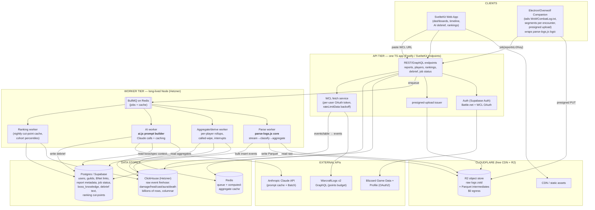

# RaidLens — Platform Vision & Roadmap

*From a single-file browser tool to a hosted, AI-native WoW analytics platform.*
*Research current as of June 2026 — WoW "Midnight," patch 12.x. Author: the RaidLens team (Christian + Claude).*

---

## 1. Executive Summary

RaidLens today is a private, single-user, client-side web tool: one `index.html` plus nine plain-JavaScript modules, opened locally in a browser. It reads World of Warcraft Mythic raid logs from the WarcraftLogs (WCL) v2 GraphQL API, aggregates per-player avoidable damage, interrupts, defensives, and Dissonance attribution across an entire raid night, and calls the Anthropic Claude API to produce a plain-English raid-leader debrief that names the players who keep repeating the same mistakes. Alongside it lives a not-yet-integrated Node streaming combat-log parser (`parse-logs.js`) that ingests raw `WoWCombatLog.txt` files — the same files WCL ingests — and classifies boss-vs-friendly damage by unit flags, extracting per-encounter spell inventories.

The plan is to grow this into a hosted, multi-user platform that fuses the best of the six tools every WoW raider already uses — WarcraftLogs (ingest, parses, rankings, replay), Wipefest (mechanic-by-mechanic "what killed you"), WoWAnalyzer (per-spec rotation coaching), QuestionablyEpic (healer throughput / gear optimization), Raider.IO (character profiles, M+ score, leaderboards), and Archon (meta builds / stat aggregation) — unified by a layer none of them have.

**The one-line thesis:** *Every incumbent gives raid leaders numbers and tools; none tell them, in plain English and between pulls, who keeps making which mistake and the single highest-leverage fix. RaidLens already does that — so the platform is an AI-native fusion of the six tools, built by lifting the two engines that already work (`ai.js` coaching, `parse-logs.js` ingest) onto cheap always-on infrastructure and feeding every new surface into the one coaching engine no competitor has.*

The key engineering insight is that **the two hard parts already exist and are good.** The analysis brain (`ai.js` + `boss-knowledge.js`) and the parse brain (`parse-logs.js`) are written, cost-tuned, and working. The platform is mostly *plumbing around two things that already work*: move them off the request path, give them durable storage, wrap a multi-user shell around them, and broker every secret server-side. This is an evolution, not a rewrite.

---

## 2. Vision & Positioning

### What RaidLens is
An **AI-native raid-coaching platform**. The product is the debrief: deterministic code computes exactly what happened (who took which avoidable hit, who missed which interrupt, who died with defensives unused), and Claude turns those numbers into a raid leader's plain-English briefing — across pulls, across a night, naming names and ranking fixes by leverage. Every other surface we add (rankings, profiles, replay, spec critique) exists to feed more signal into that engine.

### What RaidLens is NOT
- **Not a WarcraftLogs replacement.** We do not try to own the global parse corpus — that is years of millions of logs and a network-effect moat that is unwinnable for a solo developer. We are a *client* of WCL's data and rankings where it makes sense, and we own our users' own ingested data where it matters.
- **Not a gear-sim or healer-optimizer.** DPS simulation (SimC/Raidbots) and healer throughput modeling (QuestionablyEpic) are years of numerical theorycraft with no LLM edge. We integrate and translate them, never rebuild them.
- **Not a video host.** Automatic fight recording is WarcraftRecorder's job (an OBS wrapper). Hosting video is GB/hour storage and bandwidth with zero differentiation — the bankruptcy path. We point at it and deep-link timestamps.
- **Not an in-game live-callout addon.** Sandboxed Lua addons cannot make external HTTP calls mid-fight; that real-time lane belongs to WeakAuras/BigWigs. "Live" for us means *per-pull, near-real-time* via a log-tailing companion, not mid-pull callouts.

### Why the Claude layer is the moat
A critical structural fact frames the whole landscape: **RPGLogs owns three of the six tools** — WarcraftLogs, WoWAnalyzer (acquired 2022), and Archon (built by the WCL team). The "competitive landscape" is really one dominant data platform plus a few independents (Wipefest, QuestionablyEpic, Raider.IO). Almost everyone depends on the WCL pipeline, and almost everyone competes on *numbers and tools*.

None of them generate natural-language, cross-pull, repeat-offender coaching. No tool says "the same two players keep clipping the breath line — that's your highest-leverage fix tonight." That is the wedge RaidLens already owns, and it is defensible for three reasons:

1. **It is a different axis.** Incumbents compete on data depth and corpus size. We compete on *interpretation and synthesis* — a problem LLMs are uniquely good at and that none of the incumbents have built around.
2. **It compounds with every surface.** Each new data source (spec cast sequences, gear, rankings, replay events) is just more context for the same prompt. The engine gets better as the platform grows.
3. **It is cheap to run well.** With prompt caching, model tiering (Haiku for per-pull, Sonnet/Opus for synthesis), and the Batch API, a full raid night of AI coaching costs single-digit dollars — because code does the counting and Claude only does the interpreting.

The strategic rule that falls out of this: **don't fight RPGLogs' data moat — own the coaching layer on top of it.**

---

## 3. Capability Matrix

The six competitors' features versus RaidLens's intended coverage, with build difficulty for a solo developer plus Claude.

*(● = core/strong · ◐ = partial/limited · ✗ = absent. † = RPGLogs-owned. WCL = WarcraftLogs · WF = Wipefest · WA = WoWAnalyzer · QE = QuestionablyEpic · RIO = Raider.IO · AR = Archon.)*

| Capability | WCL† | WF | WA† | QE | RIO | AR† | Difficulty (us) | RaidLens today → intended |
|---|:--:|:--:|:--:|:--:|:--:|:--:|:--:|---|
| Raw combat-log ingest (server-side parse) | ● | ✗ | ✗ | ✗ | ✗ | ✗ | **Hard** | ◐ seed (`parse-logs.js`, local) → ● hosted (M3) |
| Read WCL data via API | — | ● | ● | ✗ | ✗ | ● | **Easy** | ● core path → ● server-side (M1) |
| Per-fight parses / percentile rankings | ● | ✗ | ✗ | ✗ | ◐ | ◐ | **Hard** (needs corpus) | ✗ → ◐ via WCL API + cohort (M4) |
| Replay viewer (positions/movement) | ● | ✗ | ✗ | ✗ | ✗ | ✗ | **Hard** | ✗ → ◐ timeline + AI-seek (M5) |
| Mechanic-by-mechanic "what killed us" | ◐ | ● | ✗ | ✗ | ✗ | ◐ | **Med** | ◐ → ● (core) |
| Avoidable-damage / mistake detection | ◐ | ● | ◐ | ✗ | ✗ | ◐ | **Med** | ● (`BOSS_KNOWLEDGE`) |
| Cross-pull repeat-offender tracking | ✗ | ◐ | ✗ | ✗ | ✗ | ✗ | **Easy–Med** | ● **differentiator** |
| Per-spec rotation/cooldown analysis | ◐ | ✗ | ● | ✗ | ✗ | ◐ | **Hard** (rules) / **Med** (LLM) | ✗ → ● via LLM (M6) |
| Interrupt / dispel / soak / tank-swap tracking | ● | ● | ◐ | ✗ | ✗ | ◐ | **Med** | ● interrupts + defensives |
| Death log (what hit you + CDs available) | ● | ● | ● | ✗ | ✗ | ◐ | **Med** | ◐ deaths + defensive flag |
| Natural-language AI coaching / debrief | ✗ | ✗ | ✗ | ✗ | ✗ | ✗ | **Easy–Med** | ● **core differentiator** |
| Gear optimization (best-set solver) | ✗ | ✗ | ✗ | ● | ✗ | ✗ | **Hard** | ✗ → integrate QE/Raidbots (M6) |
| Throughput / stat-weight simulation | ✗ | ✗ | ✗ | ● | ✗ | ◐ | **Hard** | ✗ → integrate SimC (M6) |
| Meta builds / tier lists (popularity) | ◐ | ✗ | ✗ | ✗ | ◐ | ● | **Hard** (needs corpus) | ✗ → integrate (read WCL) |
| Character profiles / M+ score / progression | ✗ | ✗ | ✗ | ✗ | ● | ◐ | **Easy–Med** (Blizzard API) | ✗ → ● (M4) |
| Battle.net / OAuth character linking | ✗ | ✗ | ✗ | ✗ | ● | ✗ | **Med** | ✗ → ● (M2) |
| Player-vs-player comparison | ● | ◐ | ◐ | ✗ | ● | ● | **Med** | ✗ → ● cohort (M4) |
| In-game addon (live data / hover) | ◐ | ✗ | ✗ | ✗ | ● | ✗ | **Med** | ✗ (companion instead, M3) |
| Automatic fight recording + replay | ✗ | ✗ | ✗ | ✗ | ✗ | ✗ | **Hard** | ✗ → integrate WarcraftRecorder (M5) |
| Hosted multi-user accounts / sharing | ● | ● | ● | ● | ● | ● | **Med–Hard** | ✗ → ● (M1–M2) |
| Guild recruitment / leaderboards | ◐ | ✗ | ✗ | ✗ | ● | ◐ | **Med** | ✗ → ◐ (M7) |

**Build-vs-integrate verdict (the spine):**

| Capability | Verdict | Why |
|---|---|---|
| WCL data read | **Integrate** (per-user keys) | Sanctioned via API; points charged to users |
| Blizzard profiles / M+ / equipment | **Integrate** | Cheapest data path; OAuth; free |
| Global parse rankings / meta builds | **Integrate** (read WCL) | Cold-start corpus = multi-year slog; be a client |
| Cohort / guild rankings | **Build** | No population needed; uses data you have; WCL does it poorly |
| Auth | **Buy** (Supabase + Battle.net OAuth) | Security liability; don't hand-roll |
| Combat-log ingestion | **Build later** (`parse-logs.js`) | Independence hedge + live-debrief enabler |
| Video recording | **Integrate** (WarcraftRecorder) | Hosting video = bankruptcy path |
| DPS sims / healer optimization | **Integrate** (SimC/Raidbots/QE) | Compute is the cost center; no LLM edge |
| AI coaching / parse explanation / AI-seek replay | **Build** | **The wedge. The whole point. Nobody else has it.** |

---

## 4. Target Architecture

The architecture is shaped by one realization: lift the two working engines onto a cheap always-on box, give them durable storage, run everything heavy as a background job off the request path, and have **both ingestion fronts converge on one event schema.**

### 4.1 What exists today, and its fate

| Asset | State | Fate in the platform |
|---|---|---|
| `index.html` + 9 JS modules | Client-side, no build, runs from `file://` | Frontend logic migrates into SvelteKit components/stores; WCL + Claude calls move server-side |
| `BOSS_KNOWLEDGE_META` / `BOSS_NON_AVOIDABLE` / `BOSS_KNOWLEDGE` | Hardcoded `const` spell IDs | Becomes seed data in Postgres `boss_knowledge`; still ground truth |
| Spec guides (39) + SimC enrichment | Fetched from GitHub raw at runtime | Versioned prompt assets, server-fetched + prompt-cached |
| Claude prompt builder in `ai.js` | Working, 2-block split, prompt caching | Lifts almost verbatim into the AI worker — the differentiator |
| `parse-logs.js` (flags-based, streaming) | Node, local-only, batch | Becomes the ingestion worker core — the strategic moat |
| Caching keyed by `report-encounter-pulls` | In-memory + localStorage | Becomes Redis cache + ClickHouse aggregations; the fast/deep split survives conceptually |

### 4.2 End-state component diagram



**The two ingestion fronts feed one event store.** Whether events arrive via the companion (raw log → `parse-logs.js`) or the WCL fetch service (GraphQL → normalized rows), both land in ClickHouse in **the same event schema**. Everything downstream — aggregation, AI, rankings — is source-agnostic. This is what lets RaidLens be "WCL client today, WCL-independent later" without a fork.

### 4.3 The pipeline, stage by stage

**Stage 1 — Ingestion (two fronts, one schema).**
*Front A — WCL fetch (ships first, reuses `wcl-api.js`):* today's client GraphQL calls move into a server-side WCL fetch service. The critical change: **each user authenticates their own WCL OAuth** so points are charged to them, not a shared 3,600/hr key. The service appends `rateLimitData { pointsSpentThisHour pointsResetIn }` to every query and backs off proactively, then writes results as normalized event rows into ClickHouse rather than an in-memory `playerStats`.
*Front B — Companion ingest (the moat, wraps `parse-logs.js`):* an Electron/Overwolf tray app tails `WoWCombatLog.txt`, detects `ENCOUNTER_START`/`ENCOUNTER_END`, zstd-compresses each per-encounter segment (kB–MB, not the 14 GB whole file), and PUTs it to R2 via a presigned URL — never through the API server — then posts a job `{reportId, r2Key, encounterId}`. Advanced Combat Logging is mandatory; the companion detects its absence and tells the user to enable it. The companion is `parse-logs.js` turned inside-out: batch-over-`Logfiles/` today, the same parser in tail mode tomorrow, with the classification logic (`classifySource` by flags, the `INTERESTING` event set, advanced-block length detection) reused verbatim.

**Stage 2 — Parse (worker, off the request path).**
A BullMQ parse worker on a long-lived Hetzner box streams the raw log from R2 and runs the `parse-logs.js` core. The change from today: instead of folding events into per-encounter aggregate Maps and writing a `.txt`/`.json` summary, it emits **individual normalized event rows** (it already parses them), writes **Parquet batches to R2** as an idempotent intermediate, then **bulk-inserts into ClickHouse**. A 48M-line file is single-digit minutes as a background job — fine async, fatal sync, which is exactly why this is a worker, not an HTTP handler. The per-encounter aggregate logic doesn't disappear; it moves to Stage 3 as ClickHouse `GROUP BY`.

**Stage 3 — Aggregate / derive (worker → ClickHouse + Postgres).**
The aggregate worker computes, via ClickHouse SQL, exactly the structures `analyze.js` builds in memory today: per-player `totalDmgTaken` and per-ability `{total, pulls}`; per-pull `avoidable[]` filtered to boss-knowledge spell IDs; `deadAtTime` (cross-referencing death timestamps minus battle rezzes); interrupt landed/missed/overlap (enemy-cast cross-reference); the "died on 3+ pulls with zero self-defensives" flag; and Dissonance source/target attribution (with the confirmed Chimaerus IDs the v2 re-parse found: `1267201`/`1268666` player-sourced). Small relational outputs go to Postgres; heavy event rows stay in ClickHouse; results cache in Redis keyed by `report+encounter+pullset`. **Logs are immutable once parsed, so a parsed fight's aggregates can be cached forever** — a real win over today's session-only cache.

**Stage 4 — Store (the two-database pattern).**

| Store | Holds | Why |
|---|---|---|
| **ClickHouse** (self-host on Hetzner) | Append-only event firehose: every damage/heal/cast/aura/death/interrupt row, partitioned by `(region, encounterId, partition)` | Only store that eats billions of rows on a hobby budget; sub-second `GROUP BY player/ability` is the entire UX. Self-host to avoid ClickHouse Cloud's ~$250/mo floor. |
| **Postgres / Supabase** | Users, guilds, Battle.net links, WCL tokens (encrypted), report/job metadata, `boss_knowledge`, generated debrief text, ranking cut-points | Everything relational, mutable, transactional. Do not put accounts in ClickHouse; do not put 5B event rows in Postgres. |
| **R2** | Raw logs (zstd 8–15×) + Parquet intermediates | $0 egress is decisive — workers re-read raw logs after parser fixes. Lifecycle-delete raw after parse + the 30-day TTL on API-derived data. |
| **Redis** | BullMQ jobs + computed-aggregate cache | Doubles as queue and cache; cache the *results* of expensive ClickHouse rollups keyed by immutable `report+fight`. |

**Stage 5 — Analyze (the AI layer).** See §6 milestones and the cost levers in §8; this is the differentiator and gets its own treatment throughout.

**Stage 6 — Serve.** One TypeScript app — SvelteKit server endpoints early, promoted to a standalone Fastify service when the worker tier needs independent scaling. Endpoints issue presigned uploads, enqueue jobs, return job status (the "ingesting… 38%" UI via BullMQ progress events), and serve report/player/ranking/debrief reads (ClickHouse aggregates cached in Redis). **Nothing heavy on the request path.** The frontend is SvelteKit — the smallest conceptual jump from today's plain-JS modules, compiling to tiny vanilla bundles ideal for dense tables and timelines. Today's `render.js` card/expanded-row logic becomes Svelte components; `globals.js`/`storage.js` become stores; the fast/deep toggle becomes a UI control over server-computed data.

### 4.4 Data flow: "user uploads a log → AI debrief + rankings"

1. **Auth.** User is signed in (Supabase Auth, Battle.net OAuth). For WCL data they've linked their own WCL OAuth so points bill to them.
2. **Upload.** *Companion route:* the app asks the API for a presigned R2 multipart URL → uploads the zstd segment **directly to R2**, never through the API → API writes a BullMQ job `{reportId, r2Key, encounterId}` and returns a job ID. *WCL route:* API enqueues a fetch job for the WCL fetch service instead.
3. **Parse.** A parse worker streams the log from R2, runs the `parse-logs.js` core, writes Parquet to R2, and bulk-inserts normalized event rows into ClickHouse. BullMQ progress events stream "ingesting… N%" to the browser.
4. **Aggregate.** The aggregate worker runs ClickHouse `GROUP BY` to rebuild today's `playerStats` equivalent (per-ability damage, avoidable hits, `deadAtTime`, interrupts, defensives, Dissonance), writes the summary to Postgres, caches in Redis forever (the fight is immutable).
5. **Rank.** The ranking worker places each player against the cohort's cut-points for this boss/spec/partition (kills vs progression separated), writes percentiles to Postgres.
6. **AI debrief.** The AI worker reads the aggregates + `boss_knowledge` + stripped spec guides, builds the prompt with the lifted `ai.js` logic (cached stable block + per-run data block), calls Claude (Haiku per-pull / Sonnet synthesis, Batch where non-interactive), writes the debrief to Postgres.
7. **Serve.** The browser polls/streams job status; on completion it loads the report view — Svelte components render the player cards/expanded rows (today's `render.js`, server-fed), the timeline scrubber, cohort rankings, and the AI debrief front-and-center. "Explain my parse" and "jump to the moment it went wrong" (Claude returns a timestamp, the scrubber seeks) are the AI-native flourishes.

Net latency: parse+aggregate is a background job (minutes for a full night, seconds for one pull); **the per-pull Haiku debrief can be ready before the raid finishes rebuffing.**

---

## 5. Auth, Accounts & Security

The single most important architectural change in the whole plan: **no third-party secret ever reaches the browser again.** Today every secret lives in plaintext `localStorage` and is sent directly from the browser — `storage.js` persists `clientId`, `clientSecret`, and `anthropicKey` unencrypted; `wcl-api.js` does the WCL token exchange client-side; `ai.js` calls `api.anthropic.com` with `anthropic-dangerous-direct-browser-access: true`. Fine for one trusted user; disqualifying for multi-user, where any user or any XSS can read another's keys and a browser-side Anthropic key is a blank cheque.

```
BEFORE: browser ──(WCL secret, Anthropic key)──> WCL / Anthropic
AFTER:  browser ──(session cookie)──> RaidLens API ──(server-held keys)──> WCL / Anthropic / Blizzard
```

### 5.1 Identity — Battle.net OAuth
Battle.net is the WoW-native identity and the **only credential that can prove character ownership** — the gate for linking a character or claiming a guild. All login routes through it; no email/password (no password DB to breach, no reset flow to phish). Two flows do two jobs: the **Authorization Code flow** (`wow.profile`, optionally `openid`) for human login + ownership; the **Client Credentials flow** for server-to-server reads of public Game Data (M+, equipment, realms), with an app-level token cached server-side ~24h, never per-request. Mechanics that are non-negotiable: **PKCE + signed single-use `state`** on every authorization request (kills OAuth-callback CSRF); region-aware OAuth host (`us|eu|kr|tw.battle.net`, data from `{us|eu|apac}.api.blizzard.com`); exact-match pre-registered redirect URIs; token exchange server-side only; Battle.net user/refresh tokens **encrypted at rest server-side**, never in the browser.

### 5.2 Character ownership (the part that needs care)
- **MVP:** ownership via `wow.profile`. After Authorization-Code login, call the Account Profile Summary (`/profile/user/wow`), which returns the characters on that Battle.net account. A character is "owned" iff it appears in that list — server-verified, requires the real login, cannot be spoofed by typing a name.
- **Later (defense in depth):** a change-token challenge for high-trust claims (claiming a guild, or a contested character) — place a short random token in a field only the owner can set (guild note / flavor field), re-fetch to confirm. Reserved for disputes.
- **Never** trust a client-submitted "I am CharacterX-Realm." Ownership is always derived server-side from a Blizzard call tied to the logged-in account.

### 5.3 Secret handling — the core redesign
Three classes of secret, all server-side only:

| Secret | Today | Target |
|---|---|---|
| Blizzard client_id/secret | n/a | App secret in vault; client-credentials token cached server-side |
| WCL client_id/secret (or user OAuth) | browser localStorage (plaintext) | Server vault (shared app key) and/or per-user WCL OAuth tokens encrypted at rest |
| Anthropic API key | browser localStorage + sent from browser | **One** server-held key in vault; browser never sees it |
| Battle.net user tokens | n/a | Encrypted at rest, server-side, per user |
| Our own session token | n/a | httpOnly cookie |

**Anthropic key — shared, server-only, never per-user.** Billing is ours; this is the biggest cost-abuse surface. Exactly one key, in the vault, used only by the backend. Remove `anthropic-dangerous-direct-browser-access` and `x-api-key` from the client entirely — the browser POSTs the *analysis request* to `POST /api/debrief`, and the server builds the prompt and calls Anthropic. This is what enables per-user spend caps.

**WCL key — choose the model deliberately (the "points" decision).** WCL rate-limits by points/hour (default 3,600; Gold 9,000; Platinum 18,000), reset hourly — a single shared key across many users *will* exhaust fast. Two models, both supported:
- *Model A — shared app key (MVP default):* one credential in the vault for public-report reads, protected by hard per-user/-guild outbound budgets so one user can't drain the pool; append `rateLimitData` to every query and back off at ~80% of budget.
- *Model B — per-user WCL OAuth (the scaling answer):* each user authenticates their own WCL account (`…/api/v2/user`); points charge to *them*, and we gain access to their private/unlisted reports. Tokens encrypted server-side.

**Decision: Model A at MVP, with the data model already storing per-user WCL tokens so Model B is a config flip, not a rewrite.**

### 5.4 Data model (Postgres/Supabase, illustrative)
`users` (bnet_account_id, battletag, region, soft-delete `deleted_at`) · `bnet_tokens` / `wcl_tokens` (encrypted, 1:1 with users) · `characters` (owner, `UNIQUE(region, realm_slug, name)`, `verified_at`, `blizzard_refreshed_at` for the 30-day TTL) · `guilds` (claimed_by_user_id) · `teams` (a roster within a guild) · `memberships` (user ↔ guild|team with a role) · `reports` (metadata only — **not** raw events — with a server-enforced `visibility`) · `debriefs` (model, `prompt_hash`, output, cost_cents) · `audit_log` (security events, hashed IPs). A character belongs to a user; a guild/team is a grouping; membership carries the role; raw combat events live in ClickHouse but *who can see them* is governed here.

### 5.5 RBAC — role-per-scope, server-enforced
Roles per scope: **owner** (full control + delete/transfer), **officer** (manage roster, run analyses), **raider** (run/view team analyses), **viewer** (read-only), plus **(self)** — every user always has full rights over their own characters and uploads. Permission checks are always `(user, action, scope)`: a small static role→action matrix in code, resolved against `memberships`. **Every API route does a server-side authorization check; default-deny; no "the UI didn't show the button" security.** This directly closes OWASP A01 (Broken Access Control), the #1 web risk. Sessions are first-party and server-side: after Battle.net login, mint an opaque random session ID → `httpOnly, Secure, SameSite=Lax` cookie (Lax lets the OAuth redirect carry it; the callback still re-checks `state`). Server-side sessions, not self-contained JWTs, so we can **revoke instantly** on logout/erasure/breach. CSRF tokens on all state-changing POSTs; rotate session ID on privilege change.

### 5.6 Abuse & cost protection
*Inbound:* per-IP and per-user sliding-window limits in Redis (the BullMQ Redis doubles as the limiter); strict throttling + backoff on auth endpoints (blunts credential-stuffing, OWASP A07); a global kill-switch env flag to disable expensive endpoints under attack.
*Claude budget (the surface that costs real money):* (1) auth-gated — no anonymous Claude calls, ever; (2) per-user/-team daily/monthly spend caps tracked via `cost_cents`; (3) one in-flight debrief per user + **dedupe by `prompt_hash`** (immutable input → cached debrief, $0); (4) hard input bounds (pull count, `max_tokens`, prompt size) so a crafted request can't produce a giant bill; (5) model tiering chosen server-side; (6) prompt caching; (7) Batch API; (8) Anthropic-side billing alerts as the backstop.
*WCL/Blizzard budget:* per-user/-team points budgets; `rateLimitData` self-monitoring with proactive backoff; **cache parsed fights indefinitely** (immutable) keyed by `report+fight` so two users never re-spend points on the same fight.

### 5.7 Outbound budgeting
*Blizzard* (request-count limited, ~36,000/hr @ 100 req/s): one app-level client-credentials token cached ~24h; a server-side fetch queue with a global token-bucket and per-user fairness; cache profile/equipment/M+ with hour-scale TTLs and hard-refresh anything older than 30 days (which also satisfies the retention rule).
*WCL* (points-limited, hourly reset): self-monitor every query; proactive backoff at ~80%; per-user/-team budgets; surface "approaching WCL limit, resets in N min" rather than hard-failing. Model B (per-user OAuth) is the real long-term fix.

### 5.8 Privacy & GDPR — a launch blocker, not a follow-up
Character name + realm/region, BattleTag/account ID, IP addresses, and combat data tied to a named character are all personal data; sending EU players' performance into Claude prompts is a **cross-border transfer to Anthropic (US) that must be disclosed.** Required at/before public launch: a **privacy policy naming every processor — Blizzard, WarcraftLogs, and Anthropic** (plus Cloudflare/Hetzner/Supabase); a documented lawful basis (legitimate interest + balancing test); real **DSAR export + erasure pipelines** (not TODOs). Retention pipelines built day one: Blizzard-derived data on a ≤30-day TTL; delete-on-request cascades across Postgres, ClickHouse, R2, Redis, and Anthropic-side data; a 24-hour breach-notification runbook for Blizzard-derived data. Public/leaderboard surfaces are the riskiest exposure — **default to opt-in for public display** with a per-character "don't show me on public rankings" toggle; keep cohort/guild rankings team-scoped by default.

### 5.9 OWASP must-dos
**A01 Broken Access Control** — centralized default-deny authz; ownership verified server-side; no IDOR (*top priority*). **A02 Crypto Failures** — TLS everywhere; secrets in a vault/KMS, encrypted at rest; never log secrets. **A03 Injection** — parameterized queries (Postgres *and* ClickHouse); treat log-derived text fed into Claude as untrusted, fenced, and never instruction-bearing. **A05 Misconfiguration** — security headers (HSTS, CSP, etc.); CORS allowlisting *our own origin only* (the whole point is the browser no longer calls third parties). **A07 Auth Failures** — Battle.net OAuth, throttled auth endpoints, rotated session IDs. **A10 SSRF** — allowlist outbound hosts to exactly Blizzard/WCL/Anthropic; never fetch a client-supplied URL (parse the WCL *report code* from a pasted URL, don't fetch the URL). **LLM-specific:** the debrief path gives Claude no tools/privileges, so injected text can at worst yield a bad debrief, not an action — keep it that way; render Claude output as escaped text/markdown (no stored-XSS via model output); never put secrets in prompts.

### 5.10 Secrets management (operational)
A real secrets manager / KMS-backed store (cloud secrets manager, or `sops`/`age`-encrypted secrets for the Hetzner phase) — **not** `.env` in git, **not** `.claude/settings.local.json` for production. Envelope encryption for stored user tokens (data key per row, master key in KMS), decrypted only in memory at call time. Documented key rotation + rotate-on-suspicion runbook; CI secret scanning (gitleaks/trufflehog); least privilege per environment (the worker tier gets only the secrets it needs). Incident runbook: revoke → rotate → invalidate sessions → assess exposure → notify Blizzard within 24h if their data is implicated → GDPR breach path.

---

## 6. Phased Roadmap

Effort: S = days · M = 1–3 wks · L = 1–2 mo · XL = multi-month. Cost tiers map to the Hobby / Small-paid / Grown ladder in §8.

| # | Milestone | Goal (one line) | Effort | Cost tier | Unlocks |
|---|---|---|---|---|---|
| **M0** | Current local tool | What exists today | — | ~$0 idle + a few $ Claude | The differentiator already works |
| **M1** | Leanest hosted MVP | One vertical slice live, per-user keys, secrets server-side | **M** | ~$10–30/mo | A shareable URL; multi-device |
| **M2** | Accounts + Battle.net auth | Real users, OAuth, saved reports | **M** | ~$25–40/mo | Identity, persistence, character link |
| **M3** | Own ingestion engine | Hosted `parse-logs.js` at scale + companion uploader | **XL** | ~$70–170/mo | WCL-independence; per-pull live debrief |
| **M4** | Rankings + profiles + social | Cohort rankings, Blizzard profiles, comparison | **L** | ~$70–170/mo | Raider.IO-style identity; "explain my parse" |
| **M5** | Replay + recording | Timeline scrubber + AI-seek; link WarcraftRecorder | **L** | ~$100–200/mo | The hard WCL feature, AI-native |
| **M6** | Per-spec + gear analysis | LLM rotation critique; integrate SimC/QE | **L** | ~$100–250/mo | WoWAnalyzer-class coaching, cheaply |
| **M7** | Platform polish | GDPR, donation model, multi-region, ops | **M–L** | scales with use | Legal-safe, sustainable, "real" |

The roadmap maps cleanly onto a no-rewrite evolution: **M1–M2 stand up the hosted shell while still WCL-backed; M3 owns the ingestion (the moat); M4–M6 add AI-native surfaces and integrations; M7 hardens for the public.**

### M0 — Current state (baseline)
Pure client-side tool, single-user, keys in `localStorage`, one boss live (Chimaerus) plus 8 scaffolded stubs. Already owns the wedge nobody else has: cross-pull repeat-offender tracking + natural-language coaching. Gates to the platform: no accounts, no persistence beyond one browser, secrets exposed in the client, the Anthropic key shipped to the browser.

### M1 — Leanest hosted MVP
**Goal:** the exact current behavior on a URL, with the one change everything depends on — move the Anthropic call (and ideally the WCL token exchange) behind a tiny server so secrets leave the browser. **Scope:** one SvelteKit app with two server endpoints (`POST /api/wcl` proxies GraphQL, `POST /api/debrief` calls Claude); frontend stays close to today's modules, wrapped not rewritten; **per-user WCL credentials** (points charged to the user — the single most important cost decision); **one server-side Anthropic key** with prompt caching kept; deploy as one Hetzner CAX box via Docker Compose behind the free Cloudflare CDN; `localStorage` for inputs only, no DB. **Unlocks:** a shareable link, any-device access, secrets safe — the precondition for multi-user. **Risks:** Anthropic-key abuse if `/api/debrief` is open (gate it behind an invite code even now); WCL points exhaustion if you fall back to a shared key (enforce per-user keys from day one); scope creep (resist adding accounts here — this milestone is "same tool, now hosted, secrets safe").

### M2 — Accounts + Battle.net auth
**Goal:** real multi-user identity, persistence, and the WoW-native login later features need. **Scope:** auth is bought, not built — Supabase Auth (free ≤50K MAU) with Battle.net wired as a custom OAuth provider; Postgres for all relational data (users, Battle.net links, report metadata, job status, `boss_knowledge` optionally migrated out of JS — *not* event data); per-user **encrypted** WCL credential storage replacing plaintext `localStorage`, optionally with WCL Authorization-Code flow for private reports; **region-aware from the start** (bake a `region` column in now — retrofitting it is painful); saved debriefs/report history per user. **Unlocks:** multiple real users, saved history, the Battle.net link M4 needs. **Risks:** Battle.net OAuth refresh quirks (wrap with our own expiry tracking; use `/check_token`); storing EU character names triggers GDPR — start the privacy-policy + DSAR skeleton here, not at M7.

### M3 — Own combat-log ingestion (the moat / the hedge)
**Goal:** free RaidLens from WCL's points budget for our users' own data, and unlock the single most differentiated feature — a per-pull AI debrief ready before the raid finishes rebuffing. **Scope:** the companion uploader (Electron/Overwolf tray app) that tails `WoWCombatLog.txt`, segments per encounter, zstd-compresses, and uploads — a well-trodden pattern (it's what WCL's own uploader does) reusing ~90% of `parse-logs.js`; the async parse pipeline (presigned R2 upload → BullMQ job → long-lived Node worker streams from R2, runs `parse-logs.js`, writes Parquet to R2, bulk-inserts into self-hosted ClickHouse); the two-database pattern locked in (ClickHouse firehose + Postgres relational, Redis caching immutable fight summaries forever); the per-pull near-real-time debrief (segment at `ENCOUNTER_END` → parse → Claude quick-take, comfortably inside the 60–120s between-pulls budget). **Unlocks:** WCL-independence for ingested data, the between-pulls live debrief no incumbent ships, the raw event store every later feature needs. **Risks (this is where solo projects die):** you absorb WCL's actual moat — server-side parsing of every spec/boss/expansion edge case at 14 GB / 48M-line scale (mitigate with streaming, per-encounter chunking, never whole-file, zstd 8–15× on upload); the Advanced Combat Logging dependency (detect absence and instruct the user); storage creep (lifecycle-delete raw logs post-parse); burnout (ship the uploader + parse-to-ClickHouse first; the live debrief is the reward that follows).

### M4 — Rankings + character profiles + social
**Goal:** Raider.IO-style identity and WCL-style parses — but only the versions a solo dev can actually own, all wrapped in Claude narration. **Scope:** **cohort/guild-internal rankings (build — zero population needed):** "how did each player rank within your guild / this pull set / across the night?" computed from data you already have; **display WCL global percentiles via their API** (`characterRankings`/`zoneRankings`) — be a *client* of their rankings, mind ToS on caching/redistribution; **"explain my parse" (the Claude wedge):** WCL gives a number, Claude explains *why* and the single highest-leverage fix; **Blizzard profile enrichment** (Client-Credentials flow for profile, equipment, M+ keystone, guild roster — cache hard against the ~36,000 req/hr cap); **player-vs-player comparison** within a cohort. **Unlocks:** a recruitment/identity surface and the coaching that bridges our engine to the rankings world. **Risks:** ranking cold-start (never present small-n cohort numbers as global rankings — label them honestly, e.g. `n=212, patch 12.0.5`); Blizzard 30-day TTL + delete-on-request (build expiry now); WCL ToS on caching rankings (display, don't redistribute).

### M5 — Replay + auto recording (integration)
**Goal:** the hardest WCL feature, delivered AI-natively — and recording done by pointing at WarcraftRecorder, not rebuilding it. **Scope:** **timeline / Gantt scrubber first (the 80/20):** sorted event stream + playhead + per-actor lanes (casts, debuffs as bars, deaths as markers) on Canvas/SVG — a weekend-to-fortnight feature that delivers most of "replay" value; **Claude-narrated AI-seek replay (the wedge):** "jump to where it went wrong" → Claude returns a timestamp → the UI seeks ("at 1:42 four players still stacked eat the breath — that's the wipe trigger"); **2D positional replay (optional, later):** per-actor position samples (needs Advanced Combat Logging) interpolated onto encounter-map art — weeks of polish, inherently approximate from sparse samples, gate behind demand; **recording: integrate, don't build** — point users at WarcraftRecorder (free OBS wrapper), optionally deep-link encounter timestamps to their local clips, **never host video.** **Unlocks:** visual fight understanding + AI-indexed replay no incumbent has. 3D replay is explicitly not worth it — skip. **Risks:** positional-replay scope (do the scrubber first); map-art sourcing (Blizzard tiles aren't cleanly redistributable); the video-hosting temptation (say no — defer entirely to WarcraftRecorder).

### M6 — Per-spec play + gear/healer analysis
**Goal:** WoWAnalyzer-class rotation coaching and gear advice via our asymmetric LLM advantage, integrating the sims we can't out-model. **Scope:** **LLM-driven per-spec play analysis (our best architectural bet):** the substrate already exists — 39 spec guides + embedded SimC APLs + confirmed spell IDs; compute deterministic metrics in code (uptimes, cast counts, CD alignment), then feed the player's actual cast sequence + the spec's APL/priority + metrics to Claude: "where did this player deviate, and what did it cost?" This **sidesteps the 39-module-per-patch maintenance hell** that perpetually lags WoWAnalyzer — a patch changes a *markdown guide*, not a code module. The discipline is load-bearing: don't ask the LLM to count; ask it to interpret counts, with the SimC APL as ground truth and the "confirmed IDs only / no fabrication" rule kept. **Gear/stat/healer = integrate, never build:** DPS sims → Raidbots/SimC (or run SimC via the companion locally; server-side sim farms are the cost center); healer optimization → QuestionablyEpic (Voulk's model is years of expert theorycraft); Claude as the *translator* of sim outputs ("Raidbots says +2.1% from this trinket; QE says your mastery's overvalued — here's what to reforge and why, given how your logs show you playing"). **Unlocks:** broad-but-shallow spec coverage cheaply — the LLM angle incumbents can't match on cost — plus gear advice without owning a sim farm. **Risks:** the LLM confidently wrong on rotational minutiae (scaffold with deterministic metrics + SimC ground truth; never fabricate); the temptation to build the optimizer (gear sim is numerical modeling, not an LLM problem — integrate).

### M7 — Platform polish (legal-safe & sustainable)
**Goal:** a "real," compliant, sustainable platform — the binding constraints here are legal, not technical. **Scope:** the GDPR baseline made real (privacy policy naming Blizzard/WCL/**Anthropic**, documented lawful basis, working DSAR/erasure); Blizzard ToU compliance (**no paid features on Blizzard-derived data → free/donation-funded**, 30-day TTL, 24h breach process); multi-region hardening (us/eu/apac; CN out of scope as a walled garden); ops relief only when pain — not capability — demands it (managed Redis, Supabase Pro; **stay off ClickHouse Cloud's ~$250/mo floor** until self-hosting hurts); public report sharing, guild dashboards, opt-in leaderboards on the now-mature engine. **Unlocks:** legal safety to invite the public, sustainability, trust. **Risks:** all five top risks (§9) converge here.

**Integrate, don't build** (each a multi-year slog or ruinous cost): video → WarcraftRecorder; DPS sims → SimC/Raidbots; healer optimization → QuestionablyEpic; global population → read WCL's API. Claude is the translator/unifier over these tools' outputs, not a replacement.

---

## 7. Hard Problems & How We Tackle Them

**Rankings cold-start (effectively unwinnable solo).** Percentiles are meaningful only at population scale; WCL has years of millions of logs — that's the network-effect moat. We don't compete on global rankings. Three tiers in build order: (1) **cohort/guild-internal rankings** — the ranking worker computes cut-points nightly per `(metric × spec × boss × difficulty × partition)` over *your own* ClickHouse events and interpolates exactly like WCL, just over a known cohort labeled with `n`, kills separated from progression, partitioned by patch+hotfix window; (2) **display WCL global percentiles via their API** — sanctioned client, not owner; (3) **Claude "explain my parse"** layered on either — the unique wedge, *why* the number is what it is and the highest-leverage fix.

**Replay (genuinely hard).** The 80/20 is the **timeline scrubber** — a Canvas/SVG playhead over a sorted event array with per-actor lanes — which delivers most of replay's value in a fortnight. The differentiator on top is **AI-seek**: Claude returns a timestamp for "where it went wrong" and the scrubber jumps there. The **2D positional view** (sparse advanced-log position samples, interpolated over map art) is a later, optional, inherently-approximate add, gated behind demand; 3D is not worth it.

**Recording (a category we refuse to own).** Auto-recording is OBS-style capture plus video storage and bandwidth — zero differentiation and a bankruptcy path on hosting cost. We integrate WarcraftRecorder (free, open-source) and at most deep-link encounter timestamps into the user's local clip library. We never host video.

**Real-time (constrained by how WoW works).** Addons are sandboxed Lua and cannot phone home mid-fight — the combat-log *file* is the only out-of-game real-time channel. So "live" means **per-pull near-real-time via the tailing companion**, not mid-fight callouts (that's WeakAuras/BigWigs' lane). The companion ships each segment at `ENCOUNTER_END`; the worker parses and fires a Haiku quick-take well inside the 60–120s between pulls. This is the single most differentiated feature and the one no incumbent has.

**Spec / gear / healer analysis (where the LLM has an asymmetric edge — and where it doesn't).** WoWAnalyzer's rules-based approach needs ~300 contributors maintaining ~39 spec modules per patch; coverage is perpetually uneven. Our edge is to **make it an LLM problem with deterministic scaffolding**: code computes uptimes/cast counts/CD alignment, Claude interprets them against the spec's SimC APL and guide — broad-but-shallow coverage where a patch changes a markdown file, not a code module. Conversely, gear/stat/healer *optimization* is numerical modeling with **no** LLM edge: we integrate SimC/Raidbots/QE and use Claude only to translate their outputs into plain advice. The load-bearing discipline throughout: **never ask the LLM to count — only to interpret counts**, keeping the no-fabrication rule that's already in `ai.js`.

**Server-side parsing at scale (absorbing WCL's moat).** A single player's logs hit ~14 GB / 48M lines; a guild is many such files a week. We never parse whole-file or on the request path: the companion segments **per encounter** (kB–MB) and zstd-compresses (8–15×) before upload; the parse worker streams from R2 as a background BullMQ job (single-digit minutes for a full night); raw logs are lifecycle-deleted post-parse, and the derived ClickHouse aggregates — immutable once computed — are cached forever.

---

## 8. Costs & Hosting Ladder

The design keeps idle cost near zero and scales cost with usage, leaning on three structural cost wins: **self-host the heavy store** (ClickHouse on Hetzner, not Cloud's ~$250/mo floor), **R2's $0 egress** (workers re-read raw logs for free after parser fixes), and **immutable-fight caching** (a parsed fight's aggregates and debrief never need recomputing).

| Tier | Milestone fit | Monthly | What runs |
|---|---|---|---|
| **Hobby** | M0–M2 | ~$10–40 | One Hetzner CAX box (web+API via Docker Compose), free Cloudflare CDN, Supabase free→Pro, Claude metered (a few $/night) |
| **Small-paid** | M3–M5 | ~$70–200 | Dedicated Hetzner worker box (ClickHouse + Redis + BullMQ workers), R2 storage, Supabase Pro, more Claude calls |
| **Grown** | M6–M7 | ~$100–250+ | More Claude (spec critiques), managed Redis if ops hurts, larger Hetzner; **swing factors are LLM spend and ClickHouse** |

**The Claude cost levers (several already in the code):**
1. **Prompt caching** — the stable block (boss knowledge + stripped guides + rules) is byte-identical across runs of the same boss+roster; `cache_control:{ephemeral}` bills repeats ~90% cheaper. *Already implemented in `ai.js`.*
2. **Model tiering** — Haiku 4.5 ($1/$5) for the per-pull quick-take (the cheap, fast, single-most-differentiated feature); Sonnet 4.6 ($3/$15) for end-of-night synthesis; Opus for the deepest passes. Model is chosen server-side, never from client input.
3. **Batch API** — non-interactive end-of-night syntheses run through Batch for up to ~95% off.
4. **Deterministic scaffolding** — code computes the counts (ClickHouse `GROUP BY`); Claude only interprets them. Never ask the LLM to count. This is both the cost discipline and the no-fabrication discipline.
5. **Dedupe by `prompt_hash`** — an immutable input returns the cached debrief at $0.

A 30-pull night of Haiku quick-takes plus one Sonnet synthesis, with caching + batch + dedupe, is plausibly **single-digit dollars** — well within a passion-project budget. The three AI surfaces and their model tiers:

| Surface | Trigger | Model | Why |
|---|---|---|---|
| **Per-pull quick take** | `ENCOUNTER_END` via companion, near-real-time | **Haiku 4.5** | Cheap, fast, fits the 60–120s between-pulls budget; the single most differentiated feature |
| **End-of-night synthesis** | Manual / session end | **Sonnet 4.6** (Opus for deep) | The cross-pull repeat-offender narrative — the core differentiator |
| **"Explain my parse" / per-spec deviation** | On a player/report view | **Sonnet** | LLM-over-guides+APL sidesteps WoWAnalyzer's module-maintenance hell |

---

## 9. Risks & Honest Realities

**1. Legal / ToS (the binding constraint, and it's non-technical).** RPGLogs owns WCL + WoWAnalyzer + Archon, and its API terms classify subscriptions/ads/data-resale as "commercial," requiring written approval — a hosted RaidLens proxying WCL for others is exactly that case. Blizzard's ToU forbids paid features on its data, mandates a 30-day TTL, delete-on-request, and 24h breach notice. *Mitigations:* per-user WCL keys (data charged to the user, not resold by us); a **free/donation model** (kills the subscription problem, fits fan-content non-commercial policy); build expiry + erasure pipelines from **day one (M2)**, not M7; if we ever go commercial on WCL data, get RPGLogs sign-off first.

**2. Scale / parsing cost (we'd absorb WCL's moat).** 14 GB / 48M lines per player; a guild is many files a week. *Mitigations:* streaming + per-encounter chunked ingest, never whole-file; zstd 8–15× on upload; presigned direct-to-R2; self-hosted ClickHouse on Hetzner (the only store that eats billions of rows on a hobby budget); lifecycle-delete raw logs post-parse.

**3. Ranking cold-start (effectively unwinnable solo).** Percentiles need population scale; WCL's years of millions of logs are the network-effect moat. *Mitigations:* don't compete on global rankings — build *cohort* rankings (no population needed) + read WCL's global percentiles via API; let Claude "explain the parse" be the value, not owning the number; label any own-population stats honestly with `n`.

**4. Cost (LLM + always-on infra).** Per-pull debriefs × many pulls × many users, plus idle box cost. *Mitigations:* the full lever stack in §8 — prompt caching, model tiering, Batch, dedupe, deterministic scaffolding; one cheap always-on Hetzner box for stateful work; reach for managed services only when ops, not capability, hurts.

**5. Scope / burnout (the real solo-dev killer).** Seven milestones, an XL ingestion engine, a feature list mirroring six mature products. *Mitigations:* ship the thinnest vertical slice first (M1) and keep the AI debrief as the only must-win; treat M3/M5/M6 as independent optional surfaces that each plug into the same engine — none is a prerequisite for the product being *good*; integrate aggressively (video, sims, global population) to delete whole categories of work. **The engine is done; every later milestone is "more surfaces feeding it," so partial progress is a shippable product at every step.**

---

## 10. Immediate Next Steps (from where RaidLens is today)

These are the concrete moves to begin M1 without disturbing the working tool:

1. **Stand up the minimal backend.** One SvelteKit app with two server endpoints — `POST /api/wcl` (proxies WCL GraphQL using a token) and `POST /api/debrief` (builds the prompt and calls Claude). Deploy as a single Hetzner CAX box via Docker Compose behind the free Cloudflare CDN. No DB yet.
2. **Move the Anthropic key server-side.** Remove `anthropic-dangerous-direct-browser-access` and `x-api-key` from `js/ai.js`; the browser POSTs the analysis request, the server holds the one key and calls Anthropic. Keep the existing prompt-cache 2-block structure intact — it lifts almost verbatim.
3. **Move WCL credentials server-side, per-user.** Replace the client-side `client_credentials` exchange in `js/wcl-api.js` with the `/api/wcl` proxy; keep credentials per-user so points are charged to the user, not a shared key.
4. **Strip secrets from the client.** Remove `clientSecret` and `anthropicKey` from `RL_PERSIST_FIELDS` in `js/storage.js` (keep non-secret UX fields like `reportUrl`); remove the key-entry UI; ship a one-time "your keys are now server-side" notice that wipes the old `raidlens.settings.v1` secret fields.
5. **Gate `/api/debrief` from day one.** Even a simple invite code prevents anonymous Anthropic-key abuse before real accounts exist (M2).
6. **Port the analyzer logic, don't rewrite it.** Wrap today's `analyze.js`/`render.js` modules into SvelteKit components/stores; the fast/deep split and `render.js` card logic survive as-is.
7. **Lay the groundwork for what's next:** bake a `region` column into any data model you touch (retrofitting it is painful), and keep `parse-logs.js` factored so its `classifySource`/`INTERESTING`/advanced-block logic can be lifted into the companion + parse worker at M3 unchanged.

The throughline: **the coaching engine and the parser already work — the entire platform is plumbing around two things that are already good.** Ship the thin hosted slice with secrets server-side first; everything else is more surfaces feeding the one engine no competitor has.