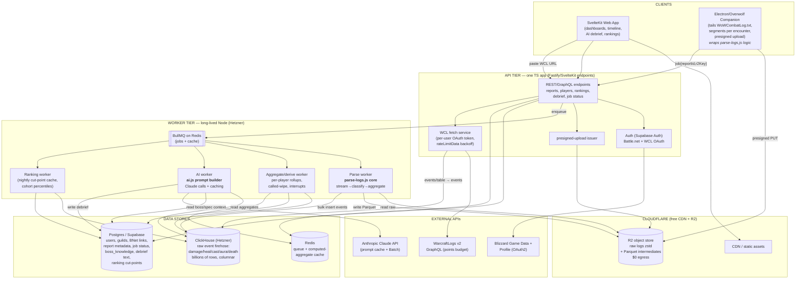

# RaidLens — Platform Vision: Research & Design Appendices

*Raw per-domain output from the research/design swarm (2026-06-26). The polished synthesis lives in PLATFORM_VISION.md; this file preserves the underlying detail.*


---

# Competitor teardown & feature matrix

I now have comprehensive, current data on all six primary tools plus WarcraftRecorder and Details!, the data-acquisition mechanics, the moats, the API access/legal constraints, and the difficulty-relevant facts (RPGLogs ownership of WCL + WoWAnalyzer + Archon; Blizzard API limits; combat-log dependence). I'll synthesize the teardown and matrix now.

---

# WoW Analytics Tools — Competitor Feature Teardown

*Research current as of June 2026 (WoW "Midnight," patch 12.x). Prepared for the RaidLens platform-evolution plan.*

A critical structural fact frames everything below: **RPGLogs owns three of the six tools.** WarcraftLogs, WoWAnalyzer (acquired 2022), and Archon.gg (built by the WCL team) are one company. The "competitive landscape" is really **one dominant data platform (RPGLogs) + a few independents (Wipefest, QuestionablyEpic, Raider.IO).** Almost everyone depends on the WCL combat-log pipeline. This is the single most important strategic reality for RaidLens.

---

## 1. WarcraftLogs (WCL) — the data layer everyone else sits on

**Core purpose:** Server-side parsing of raw WoW combat logs into a queryable, rankable, replayable database of every fight. It is the de facto standard for raid/M+ performance measurement.

**Killer features**
- **Parses & rankings** — per-fight DPS/HPS scored as a percentile (0–100) against everyone of your spec/boss/difficulty in the current ranking window, color-coded grey→gold. Two flavors: rDPS/"Historical" (includes external buffs your group gave you) vs aDPS/"Adjusted" (strips external buffs — what theorycrafters use).
- **Replay viewer** — reconstructs the fight as moving dots on the encounter floor: player/enemy positions, movement, ability casts, raid-frame health bars, scrub/speed controls, click-an-event-to-jump. This is their hardest-to-replicate feature.
- **Deep tables & timelines** — damage done/taken, healing, casts, deaths, buffs/debuffs uptime, per-ability breakdowns, pin/filter expressions.
- **Public report sharing + guild/leaderboard infrastructure**, plus the **Race to World First** real-time tracking that drives seasonal traffic.
- **The v2 GraphQL API** — the thing RaidLens already consumes.

**Data it needs:** the full raw combat log (`WoWCombatLog.txt`) with **Advanced Combat Logging** enabled (Settings → System → Network) — advanced logging is what yields position/resource data and powers the replay.

**How it acquires data:** A desktop **uploader app** signs in via Battle.net, watches the log file in real time, and auto-uploads when a key/raid session ends (or live-logs during the fight). Raw logs in → server-side parse → public report.

**Secret sauce / moat:** (1) The **historical corpus** — years of every parse ever, which makes rankings meaningful; a new ranking site is worthless on day one. (2) The **server-side parser** handling every spec/boss/expansion edge case. (3) **Network effect** — guilds require WCL logs for recruitment, so everyone logs to WCL. (4) Owning WoWAnalyzer + Archon as downstream value-adds. The moat is the dataset and the habit, not the code.

---

## 2. Wipefest — "what mechanic killed the raid?"

**Core purpose:** A **mechanics-and-deaths** analysis layer on top of WCL reports, aimed at raid leaders rather than individual parsers. Answers "why did we wipe?" not "what's my DPS percentile?"

**Killer features**
- **Insights** — auto-collated per-pull answers to mechanical questions: avoidable damage taken, debuff durations, dispel timings, enemy healing, tank swaps, soak assignments, interrupts.
- **Per-mechanic death attribution** — "5 deaths to Searing Glare, 3 to Stomp, 2 to overlapping debuffs," ordered by which mechanics the cleanest recent kills handled correctly (a data-driven importance score sampled from kills in the last ~2 weeks).
- **Timeline view** — high-level event ribbon: boss casts, debuffs, raid CDs, deaths.
- **"Ignore events after wipe called"** — integrates with the WCL uploader's "Call Wipe" hotkey (and 1–5 death cutoffs) so progression noise after the wipe is excluded — directly analogous to RaidLens's `deadAtTime >= 3` heuristic.

**Data it needs:** Parsed WCL report data (events, deaths, casts, debuffs) — it does **not** ingest raw logs itself.

**How it acquires data:** Paste a WCL report URL → Wipefest pulls via the **WCL API**. Pure derivative layer.

**Secret sauce / moat:** The **hand-curated, per-boss mechanic configs** — knowing which spell IDs map to which named mechanic, what's avoidable vs intended, and the kill-sample importance weighting. This is exactly the category of knowledge RaidLens hardcodes in `BOSS_KNOWLEDGE`. Note Wipefest is **embedded inside Archon** now (RPGLogs distributes it), so its independence is partial. **This is RaidLens's closest conceptual competitor** — but RaidLens layers Claude-generated cross-pull coaching on top, which Wipefest does not.

---

## 3. WoWAnalyzer — per-spec rotation coach (RPGLogs-owned)

**Core purpose:** Spec-specific play analysis. Encodes how each spec is *supposed* to be played and flags where you deviated.

**Killer features**
- **Checklist + Suggestions** — rule-based findings sorted by severity (red-X critical → minor), e.g. "you wasted 3 Holy Power," "Demon Spikes uptime too low," with concrete fixes.
- **Spec-aware statistics** — DoT/buff uptimes, talent/item contribution, resource waste, cooldown alignment, computed per spec.
- **Second-by-second timeline** of every cast/buff for rotation inspection.
- **Spec intelligence** — knows the Frost Mage priority list, Windwalker resource model, Affliction CD alignment, etc., comparing actual vs ideal.

**Data it needs:** A WCL report **with Advanced Combat Logging** (it needs resource/aura granularity).

**How it acquires data:** Paste a WCL report URL → pulls via WCL API.

**Secret sauce / moat:** ~**300+ open-source community contributors** each maintaining their own spec module — an enormous distributed theorycrafting effort that is the moat *and* the weakness: **spec coverage is uneven** (some specs deeply analyzed, others "needs more work" or stale for the current patch). Replicating all 39 specs by hand is a multi-year community-scale effort. **This is the hardest single capability for a solo dev to match by rules** — but it's precisely where an LLM ("here's the spec guide + this player's cast timeline, critique it") could approximate broad-but-shallow coverage cheaply, which is RaidLens's natural angle.

---

## 4. QuestionablyEpic (QE Live) — healer gear/throughput optimizer

**Core purpose:** Theorycrafting and **gear optimization for healers** (now broadened to all retail specs). It's a *simulation/optimization* tool, not a log-analysis tool — a different axis entirely.

**Killer features**
- **Top Gear** — brute-forces every combination of your owned gear (incl. Great Vault options and manually-added items), accounting for set bonuses, **stat diminishing returns**, and embellishments, to output the best set; highlights changes vs equipped (yellow) and Vault items (blue).
- **Healer throughput modeling** ("sim healing, kinda") — stat weights and HPS estimation for specs that don't sim cleanly in SimC.
- **Upgrade Finder / trinket & embellishment evaluation.**

**Data it needs:** Your **character's full item/gear set** — imported as a **SimC string** (from the in-game SimulationCraft addon export), not combat logs.

**How it acquires data:** **Manual SimC-string paste** + optional manual item entry. No combat-log or WCL dependency.

**Secret sauce / moat:** The **healing throughput model and DR/embellishment math** — bespoke modeling that healers can't get from SimC (which historically modeled DPS far better than HPS). Niche but loyal audience. **Least overlap with RaidLens** — it's gear-optimization, not mistake-detection. Mentioning it mainly clarifies that "gear optimization" is a separate, heavily SimC-dependent problem RaidLens shouldn't chase early.

---

## 5. Raider.IO — character profiles, M+ score, recruitment

**Core purpose:** The **identity and reputation layer** for players — M+ scores, raid progression, guild/character profiles, recruitment, leaderboards. Not combat analysis at all; it's "who is this player and how good are they?"

**Killer features**
- **Mythic+ Score (RIO score)** — the community-standard single number for M+ skill, with best-run breakdowns and timed-run counts per season.
- **Character & guild profiles** + **raid progression** tracking and the seasonal **Race** coverage.
- **In-game addon + desktop client** — hover any player to see RIO score / raid progress / recruitment status, populated from a downloaded data snapshot.
- **Recruitment marketplace** + a **public developer API** others build on.

**Data it needs:** Character M+ runs, raid kills, gear, achievements — i.e. **Blizzard's own data**, not combat logs.

**How it acquires data:** Primarily the **Blizzard Battle.net API** (M+ leaderboards capped at the top 500 runs per realm/dungeon snapshot; character profile/equipment/progression endpoints) + their addon distributing precomputed snapshots back into the game.

**Secret sauce / moat:** **RIO score became the social standard** — pugs gate invites on it, so everyone needs a profile, which feeds the data, which reinforces the standard. Pure network effect built on *free Blizzard data*. Importantly, **this is the cheapest data source to access** (Blizzard API, OAuth, ~100 req/s & 36,000 req/hr default) and the most realistic "character profile / Battle.net linking" piece for RaidLens to add.

---

## 6. Archon.gg — popularity/meta build aggregator (RPGLogs-owned)

**Core purpose:** Turns the WCL corpus into **"what are the best players actually running?"** — tier lists, builds, stat priorities, and a content hub that *also re-hosts Wipefest + WoWAnalyzer + boss guides* in one place.

**Killer features**
- **Data-driven builds** — talents, gear, gems, enchants, consumables, trinkets aggregated from top logs. Methodology: per encounter, sample the **top 50% (or top 1,000, whichever larger)** of de-duplicated ranks, compute builds, then pool per-boss top-end sets into an "All Bosses" dataset.
- **Four tier lists** — Throughput (95th-percentile DPS/HPS), M+ Score, Popularity (parse counts, trailing 2 weeks), and Survivability (death stats).
- **Boss guides** with animated GIFs + role filters, and **embedded Wipefest/WoWAnalyzer** integration.

**Data it needs:** The entire WCL parse store (gear/talent/enchant metadata attached to ranked logs).

**How it acquires data:** **Internal/privileged access to the WCL database** (same company) — no upload step for end users.

**Secret sauce / moat:** **Direct ownership of the WCL dataset** + a clean consumer-facing presentation that competes with Wowhead/Icy-Veins for "what build should I play" traffic. A solo dev cannot replicate the aggregation moat (it requires the corpus), but the *presentation* of meta data is replicable if you can source the data.

---

## Honorable mentions

**WarcraftRecorder** — open-source desktop tool that **auto-records WoW gameplay** (detects encounter start/stop, labels boss/trash/M+ clips), with a built-in replay viewer. Free tier = local recording; Pro (~$5/mo) adds cloud storage, multi-POV, shareable URLs, browser access. **Relevant because "automatic fight recording + replay" in the RaidLens vision is essentially this** — and it's a *huge* lift (OBS-style capture, storage, video pipeline). Realistically: integrate/point at it, don't rebuild it.

**Details! Damage Meter** — the dominant **in-game addon** (Lua). Real-time damage/healing/interrupts/dispels/deaths, advanced **death logs** (what hit you + which CDs were up/available at death), cast logs, WeakAuras/Plater integration. Matters because it's the **only tier that sees the fight live, in-client** — anything RaidLens wants in-game (live coaching, auto-export) means writing an addon, and addons can't make external HTTP calls, so they can only write SavedVariables for a companion app to read.

---

## Consolidated capability matrix

Columns: **WCL** = WarcraftLogs · **WF** = Wipefest · **WA** = WoWAnalyzer · **QE** = QuestionablyEpic · **RIO** = Raider.IO · **AR** = Archon · **Diff** = build difficulty for a solo dev + Claude · **RaidLens?** = current RaidLens status.

*(● = core/strong, ◐ = partial/limited, ✗ = absent. †RPGLogs-owned.)*

| Capability | WCL† | WF | WA† | QE | RIO | AR† | Diff (us) | RaidLens today |
|---|:--:|:--:|:--:|:--:|:--:|:--:|:--:|---|
| Raw combat-log ingest (server-side parse) | ● | ✗ | ✗ | ✗ | ✗ | ✗ | **Hard** | ◐ seed (`parse-logs.js`, local Node, not hosted) |
| Read WCL data via API | — | ● | ● | ✗ | ✗ | ● | **Easy** | ● core data path |
| Per-fight parses / percentile rankings | ● | ✗ | ✗ | ✗ | ◐ M+ | ◐ | **Hard** (needs corpus) | ✗ |
| Replay viewer (positions/movement) | ● | ✗ | ✗ | ✗ | ✗ | ✗ | **Hard** | ✗ |
| Mechanic-by-mechanic "what killed us" | ◐ | ● | ✗ | ✗ | ✗ | ◐(WF) | **Med** | ◐ avoidable-dmg + death attribution |
| Avoidable-damage / mistake detection | ◐ | ● | ◐ | ✗ | ✗ | ◐ | **Med** | ● core (`BOSS_KNOWLEDGE`) |
| Cross-pull repeat-offender tracking | ✗ | ◐ | ✗ | ✗ | ✗ | ✗ | **Easy–Med** | ● **differentiator** |
| Per-spec rotation/cooldown analysis | ◐ | ✗ | ● | ✗ | ✗ | ◐(WA) | **Hard** (rules) / **Med** (LLM) | ✗ (spec guides fetched, not yet analyzed) |
| Interrupt / dispel / soak / tank-swap tracking | ● | ● | ◐ | ✗ | ✗ | ◐ | **Med** | ● interrupts + defensives |
| Death log (what hit you + CDs available) | ● | ● | ● | ✗ | ✗ | ◐ | **Med** | ◐ deaths + defensive-usage flag |
| Natural-language AI coaching / debrief | ✗ | ✗ | ✗ | ✗ | ✗ | ✗ | **Easy–Med** | ● **core differentiator (Claude)** |
| Gear optimization (best-set solver) | ✗ | ✗ | ✗ | ● | ✗ | ✗ | **Hard** | ✗ |
| Throughput/stat-weight simulation | ✗ | ✗ | ✗ | ● | ✗ | ◐ | **Hard** | ✗ |
| Meta builds / tier lists (popularity-aggregated) | ◐ | ✗ | ✗ | ✗ | ◐ | ● | **Hard** (needs corpus) | ✗ |
| Character profiles / M+ score / progression | ✗ | ✗ | ✗ | ✗ | ● | ◐ | **Easy–Med** (Blizzard API) | ✗ |
| Battle.net / OAuth character linking | ✗ | ✗ | ✗ | ✗ | ● | ✗ | **Med** | ✗ |
| Player-vs-player comparison | ● | ◐ | ◐ | ✗ | ● | ● | **Med** | ✗ |
| In-game addon (live data / hover scores) | ◐ uploader | ✗ | ✗ | ✗ | ● | ✗ | **Med** (Lua + companion) | ✗ |
| Automatic fight video recording + replay | ✗ | ✗ | ✗ | ✗ | ✗ | ✗ (WarcraftRecorder) | **Hard** | ✗ |
| Hosted multi-user accounts / sharing | ● | ● | ● | ● | ● | ● | **Med–Hard** | ✗ (single-user, localStorage keys) |
| Guild recruitment / leaderboards | ◐ | ✗ | ✗ | ✗ | ● | ◐ | **Med** | ✗ |

---

## Key strategic takeaways for RaidLens

1. **The market is consolidated under one owner.** RPGLogs controls the data pipeline (WCL) *and* the two best analysis layers (WoWAnalyzer, Archon). Building "on top of WCL" means building on a competitor's platform — and their **API terms classify subscriptions/ads/repackaging data-for-sale as "commercial," requiring written approval.** A hosted, multi-user RaidLens that proxies WCL data for others is exactly the use case that needs RPGLogs sign-off. This is the biggest non-technical risk; plan for it explicitly.

2. **RaidLens already owns the one thing nobody else has: AI-native cross-pull coaching.** No competitor generates natural-language "this specific player keeps doing this specific thing" debriefs, and none track repeat offenders across a night. That's the wedge — lean into it rather than chasing parses/replay/gear-sim.

3. **The "easy/cheap" expansion is the Blizzard API path** (character profiles, M+ score, raid progression, OAuth linking; ~100 req/s, 36,000/hr, free). It's how RaidLens gets Raider.IO-style identity features without touching the WCL commercial-terms minefield.

4. **The hard/expensive items are corpus-dependent or media-heavy** and should be deprioritized or outsourced: rankings/meta-builds (need years of data you don't have), the replay viewer (genuinely hard), gear-sim (QE/SimC-grade modeling), and auto-recording (that's WarcraftRecorder — integrate, don't rebuild).

5. **`parse-logs.js` is the strategic hedge.** Direct combat-log ingest is the *only* path that frees RaidLens from RPGLogs' API and terms entirely — but doing it hosted means absorbing the server-side parsing burden (14 GB / 48M lines per player) that is precisely WCL's moat. Worth keeping as an independence option; expensive as a primary architecture.

---

## Sources

- [WarcraftLogs — Rankings & Parses guide](https://www.warcraftlogs.com/help/ranks/) · [WCL v2 API docs](https://www.warcraftlogs.com/api/docs) · [RateLimitData](https://www.warcraftlogs.com/v2-api-docs/warcraft/ratelimitdata.doc.html)
- [How to use Warcraft Logs (Wowhead)](https://www.wowhead.com/guide/how-to-use-warcraft-logs-6341) · [WCL replay — how positions work (WCL forums)](https://forums.combatlogforums.com/t/how-do-wcl-replay-get-player-position/1889)
- [Wipefest.gg](https://www.wipefest.gg/) · [How to Improve Your Raid With Wipefest (Archon)](https://www.archon.gg/wow/articles/help/how-to-improve-your-raid-with-wipefest) · [WoWAnalyzer vs Wipefest](https://thegamercodex.com/en/world-of-warcraft/compare/wowanalyzer-vs-wipefest)
- [How to Use WoWAnalyzer (Wowhead)](https://www.wowhead.com/guide/how-to-use-wowanalyzer-6138) · [WoWAnalyzer acquired by Warcraft Logs (Wowhead)](https://www.wowhead.com/news/wowanalyzer-acquired-by-warcraft-logs-324677) · [WoWAnalyzer GitHub](https://github.com/mmhand123/WoWAnalyzer)
- [QE Live — Top Gear](https://questionablyepic.com/live/topgear) · [How to Use QE Live (Wowhead)](https://www.wowhead.com/guide/how-to-use-qe-live-tool-guide) · [QE Live guide (XPGoblin)](https://www.xpgoblin.com/questionably-epic-live-tool-comprehensive-guide/)
- [Raider.IO Addon](https://raider.io/addon) · [Raider.IO Developer API](https://raider.io/api) · [How the M+ Leaderboard/API works (Raider.IO)](https://support.raider.io/kb/frequently-asked-questions/how-does-the-mythic-plus-leaderboard-slash-api-capacity-work)
- [Archon — WoW Midnight](https://www.archon.gg/wow) · [Archon Disclaimers & FAQ](https://www.archon.gg/wow/articles/help/archon-disclaimers-and-faq) · [Archon tier lists/builds launch (Wowhead)](https://www.wowhead.com/news/archon-feature-launch-popularity-based-tier-lists-and-character-builds-by-336729)
- [RPGLogs API Terms of Service](https://www.archon.gg/wow/articles/help/rpg-logs-api-terms-of-service) · [WCL API v2 request limits (forums)](https://forums.combatlogforums.com/t/api-v2-requests-limit-per-second-minute-hour/14659)
- [Battle.net Game Data APIs](https://community.developer.battle.net/documentation/guides/game-data-apis) · [Using OAuth (Battle.net)](https://community.developer.battle.net/documentation/guides/using-oauth) · [Blizzard API rate limits (forums)](https://us.forums.blizzard.com/en/blizzard/t/api-access-clients-rate-limits/5602)
- [Warcraft Recorder (MajorGeeks)](https://www.majorgeeks.com/files/details/warcraft_recorder.html) · [Details! Damage Meter (CurseForge)](https://www.curseforge.com/wow/addons/details) · [Details! GitHub](https://github.com/Tercioo/Details-Damage-Meter)


---

# External APIs & legal/ToS surface

I have enough to triangulate the WCL points number: the standard/default budget is 3,600 points per hour (Gold = 9,000, Platinum = 18,000), with the per-hour reset and query complexity driving cost. I have comprehensive, well-sourced coverage across all five areas. Let me synthesize the final report.

---

# RaidLens Platform — External Integration & Legal/ToS Surface

Research report on the external dependencies and legal constraints that will shape a hosted, multi-user RaidLens. Bottom line up front: **ride on the Blizzard + WarcraftLogs APIs for everything you can early, and treat your own combat-log ingestion as the long-game differentiator — not the v1 foundation.** The legal/ToS surface is the real architectural constraint, not the technical one.

---

## (a) Battle.net / Blizzard OAuth2

Blizzard secures all its developer APIs with **OAuth 2.0**, and there are two flows you will use for different purposes.

### Two flows, two jobs
- **Client Credentials flow** — your *server* exchanges a `client_id` + `client_secret` for an app-level access token. This is for reading **public Game Data** (realms, items, spells, leaderboards, M+ affixes) and **public character profiles**. No user login involved. This is what you'll use for the bulk of RaidLens data fetching.
- **Authorization Code flow** — gets an *individual user's* permission, returning a token tied to their Battle.net account. Required only when you need account-private data or want to prove "this RaidLens user really owns this WoW character" (Battle.net character linking).

### Endpoints and regional hosts
There are two distinct host families and getting them right matters:

- **OAuth (auth/token):** a single global host `https://oauth.battle.net` is the modern endpoint, but region-prefixed hosts still exist and are widely used:
  - US: `https://us.battle.net/oauth`
  - EU: `https://eu.battle.net/oauth`
  - KR/TW (now folded into APAC): `https://kr.battle.net/oauth`, `https://tw.battle.net/oauth`
  - CN: `https://www.battlenet.com.cn/oauth` (China is a separate operator/walled garden — treat as out of scope)
  - Endpoints under each: `/authorize`, `/token`, `/check_token?token={token}` (token introspection, all regions).
- **API data hosts** are region-specific and separate from the OAuth host: `https://{region}.api.blizzard.com` where `{region}` is `us`, `eu`, or `apac`. **APAC replaced the old `kr`/`tw` regions.** Tokens and data are region-scoped — a token minted on the US host queries the US data host.

### Scopes
This is refreshingly simple. With **no scopes at all**, an app that does Battle.net login still gets the user's **account ID and BattleTag** — enough for basic "Sign in with Battle.net." Beyond that:
- `wow.profile` — access the user's WoW characters (the one you care about).
- `sc2.profile`, `d3.profile` — other games (irrelevant to RaidLens).
- `openid` — OIDC identity (there are dedicated OIDC endpoints).

### Token lifetimes
- **Client Credentials** tokens are long-lived (historically ~24 hours / 86,399s). Cache them server-side and refresh on expiry; do **not** mint one per request.
- **Authorization Code** user tokens are also long-lived but bounded; Battle.net's refresh-token behavior is quirky and several OAuth libraries have hit "invalid expiration duration" bugs with the Battle.net provider, so budget some integration friction. Use `/check_token` to validate.
- Redirect URIs must be pre-registered on your app; standard authorization-code redirect rules apply.

---

## (b) Blizzard Game Data + Profile APIs — what's exposed, and the rate limit

All consumers need a Battle.net account and a registered client. There are two families: **Game Data APIs** (static/world data, client-credentials) and **Profile APIs** (character/guild data).

### What you can get (the useful-for-RaidLens subset)
- **Character Profile Summary** — level, race, class, **active spec**, item level, faction, guild, last-login.
- **Character Equipment** — full gear list with item IDs, **enchants, gems, bonus IDs, sockets** — i.e. enough to reconstruct a character's build (the QuestionablyEpic / Archon "gear & stat optimization" angle).
- **Character Mythic Keystone Profile** — current season + per-season **best M+ runs** (the Raider.IO-style score angle). *Caveat: it returns only **best** runs per dungeon, not full run history.*
- **Character Achievements, Statistics, Specializations, Media** (the 3D/render thumbnails), Titles, PvP, Reputations, Professions, Collections.
- **Guild** — profile, **roster** (`/data/wow/guild/{realmSlug}/{nameSlug}/roster`), and achievements. This is your hook for "import my guild."
- **Game Data (static):** realms, connected realms, M+ **leaderboards** per dungeon/period, M+ affixes, items, item-media, spells, journal (encounter/instance) data, playable classes/specs, talent trees. The journal + spell endpoints can replace some of your hardcoded boss-knowledge tables over time.

### The hard rate-limit number
- **36,000 calls/hour at 100 requests/second**, per the Blizzard Developer API Terms of Use. Exceed it (or degrade their service) and they may throttle/suspend. 429s are the symptom.
- That's generous for one guild but **does not scale linearly to many users** — you'll want aggressive caching and a server-side fetch queue from day one. Profile data is also only refreshed on Blizzard's side when the character is played, so polling fast buys you nothing.

---

## (c) WarcraftLogs v2 GraphQL API — auth, points, and the boundaries

### Auth model
- **Public API:** `https://www.warcraftlogs.com/api/v2/client` — **Client Credentials** flow. POST `client_id`/`client_secret` (HTTP Basic) to the token URI, get a Bearer token, attach to the `Authorization` header. This covers public reports, rankings, and character/guild data.
- **Private/User API:** `https://www.warcraftlogs.com/api/v2/user` — **Authorization Code** flow. Required to read a user's **private (unlisted) reports** with their consent.
- It's a single **GraphQL** endpoint; they recommend Insomnia for exploration.

### The points-based rate limit (this is the one that will bite you)
WCL does **not** count requests — it counts **points**, where a query's cost scales with its **complexity** (how much data it touches; deep `events`/`table` queries over many fights are expensive).
- **Reset cadence:** points fully reset on **1-hour cycles**.
- **Default budget:** **3,600 points/hour** for a standard developer account.
- **Subscriber tiers raise it:** **Gold = 9,000/hr**, **Platinum = 18,000/hr** (tied to a paid WCL subscription).
- You can append `rateLimitData { limitPerHour pointsSpentThisHour pointsResetIn }` to **any** query to self-monitor — do this and back off proactively.

This maps directly onto your existing fast-path/deep-path split: a multi-user hosted version sharing **one** app-level WCL key will exhaust 3,600 points fast. Realistic options: (1) require each user to supply *their own* WCL OAuth (points charged to them, not you), (2) buy Platinum and cache hard, or (3) reduce reliance on WCL by ingesting logs yourself (see d).

### What WCL exposes vs. what it does NOT
**Exposes:** reports (fights, friendlies/enemies, deaths), **event streams** (damage/heal/cast/aura/etc., paginated), **table** aggregates (damage done/taken, healing, casts, interrupts, buffs/debuffs), **rankings/parses** (per boss/spec percentile), and **character/guild** summaries with zone rankings. Essentially everything your tool already reads.

**Does NOT expose / limitations:**
- **No bulk/scrape access.** You can't pull "all reports for a zone." You query reports you have codes for, plus rankings.
- **Private reports** need explicit user OAuth — you cannot see a guild's unlisted logs without them.
- **No raw replay-positional firehose** beyond what events provide — and pulling full event detail for many fights is exactly what burns your points budget.
- It is fundamentally a **read API over WCL's own ingested data** — you are downstream of *their* parsing, *their* spell tables, *their* rankings. You don't own the pipeline.

---

## (d) Combat-log acquisition — the WCL-independent path

This is where your `parse-logs.js` seed becomes strategically interesting, because it removes the WCL dependency entirely.

### How the client writes the file
- Logging is toggled in-game with `/combatlog` (or an AutoCombatLogger addon). Events are appended to **`WoWCombatLog.txt`** in the `Logs/` subfolder of the install (`.../World of Warcraft/_retail_/Logs/`).
- The client **buffers**: outside raids it only flushes after a number of events accumulate, and it fully writes/closes on logout or returning to the character screen. In raids it writes near-continuously, which is what makes live tailing viable.

### "Advanced Combat Logging" — mandatory and separate
- This is a **distinct one-time setting**: System → Network → "Advanced Combat Logging", or `/console advancedCombatLogging 1`. It is **not** toggled by `/combatlog` or by AutoCombatLogger addons.
- It adds the extra fields serious analysis needs: **precise actor positions, full resource/power state, and richer spell info per event**. WCL **rejects/degrades logs without it**, so any RaidLens self-ingestion must detect its absence and tell the user to enable it (you already classify by unit FLAGS — advanced logging is what makes that reliable).

### How companion uploaders auto-ship logs
- The **WarcraftLogs Companion** (Overwolf overlay) and the standalone **Uploader** (Electron) both work the same way: they **tail the log file**, and when they see new events appended, they **POST the new chunk to the website after each encounter ends** ("Live Logging"). Closing the window doesn't stop it; a "Call a Wipe" hotkey injects a wipe marker.
- They also do **batch upload** of a finished file, with UI to **select which fights** to include and to **split a multi-day file into one report per day**.
- **Architectural takeaway for RaidLens:** a small Electron/Overwolf desktop companion that tails `WoWCombatLog.txt` and streams chunks to your own backend is a **well-trodden, technically modest** pattern. Your `parse-logs.js` is already the parser; wrapping it in a file-tailer + uploader is the realistic bridge from "WCL-dependent web tool" to "owns its own ingestion." The 14 GB / 48M-line scale you hit is exactly why ingestion must be **streaming + per-encounter chunked**, never "upload the whole file."

---

## (e) The legal reality — this is the binding constraint

The technical work is the easy part. These terms genuinely shape what RaidLens-as-a-platform is allowed to be.

### Blizzard Developer API Terms of Use — the load-bearing clauses
- **No paywalling.** "Premium" tiers with extra **for-pay** features are **not permitted**, and you **cannot charge users** to download or use an app built on the API. → A subscription RaidLens built *on Blizzard data* is off the table. Donations/cosmetics are a grey area at best.
- **Mandatory 30-day data TTL.** You must refresh any API-derived data **at least every 30 days** and not retain stale copies indefinitely. → You cannot build a permanent historical Armory; you must re-fetch or expire. This directly fights "we keep all your data forever."
- **Right to erasure / de-linking.** If a user (directly, via Blizzard, or by de-linking their account) asks you to stop, you must **immediately cease use and delete all copies** of their data. → You need a real account-deletion pipeline, not a TODO.
- **Breach notification within 24 hours** to Blizzard if data leaks. → Security incident process required.
- **36,000 calls/hour cap** (see b) is also a contractual term, not just a technical throttle.

### Fan content policy
Blizzard's fan-content stance permits **non-commercial** fan creations under the EULA. RaidLens fits the fan-tool mold *as long as it stays non-commercial* — which dovetails with (and is reinforced by) the API ToU's no-charging rule.

### GDPR — storing EU player names
- **Character names are likely personal data.** GDPR's "indirect identification" test catches them: a character name plus realm, combined with other reasonably-accessible data, can identify a real person. WCL/Raider.IO operate at scale doing exactly this, but they have proper privacy infrastructure.
- **IP addresses are personal data** in most contexts (the *Breyer* CJEU line). If you log requests, you're processing personal data.
- **You'll need:** a privacy policy naming third parties (Blizzard, WarcraftLogs, **Anthropic** — since combat data goes into Claude prompts), a **lawful basis** (legitimate interest with a documented balancing test is the usual route for analytics tools, but it must be honored), and **data-subject request handling** (access/erasure). The Blizzard 30-day TTL and delete-on-request rules conveniently push you toward GDPR compliance anyway.
- **Anthropic data flow is its own disclosure:** sending EU players' performance data to a US LLM provider is a cross-border transfer you must surface in the policy.

### Competing with WarcraftLogs — the practical risk
- WCL's own data is **theirs**; their site terms govern reuse. Reading via their **official API within the points budget is sanctioned**; **scraping** their pages or redistributing their rankings is not. Archon (same parent company, RPGLogs) is the model of a *sanctioned* downstream consumer.
- Realistically you are **not** going to dethrone WCL, and you shouldn't frame it that way. The defensible niche is the **AI-native coaching layer** on top of data you're allowed to use — not re-hosting their rankings. If you ingest your own logs (d), you sidestep WCL's terms entirely for *that* data, but then you own all the storage/GDPR burden yourself.

---

## Recommended integration strategy

**Phase 1 — Ride the APIs (don't build ingestion yet).**
- **Blizzard:** Client-Credentials for character/guild/M+/equipment enrichment; Authorization-Code only for "link your Battle.net" + private data. Region-aware (us/eu/apac data hosts; matching OAuth host). Cache server-side; one app token, not per-request.
- **WarcraftLogs:** keep your current model but **have each user authenticate their own WCL OAuth** so points are charged to them, not a shared 3,600/hr key. Always append `rateLimitData` and back off.
- This gets a multi-user platform live with minimal infrastructure and keeps the AI debrief as the differentiator.

**Phase 2 — Build your own ingestion as the moat.**
- Ship a small **Overwolf/Electron companion** that tails `WoWCombatLog.txt` (requiring **Advanced Combat Logging**) and streams per-encounter chunks to a RaidLens backend running your `parse-logs.js`. This frees you from WCL's points budget and parsing decisions for your own users' data, and unlocks the replay/timeline ambitions WCL's read API can't feed cheaply.

**Hard constraints that shape the architecture (non-negotiable):**
1. **No paid features on Blizzard-derived data** — kills the subscription model; plan to be free/donation-funded.
2. **30-day TTL + delete-on-request + 24h breach notice** — build expiry and erasure pipelines from day one, not later.
3. **WCL points are the bottleneck, not requests** — design around per-user keys and heavy caching, or self-ingest.
4. **GDPR applies the moment you store an EU character name or IP** — privacy policy, lawful basis, DSAR handling, and disclosure of the **Anthropic** data flow are launch blockers, not nice-to-haves.
5. **Region split is real** (us/eu/apac data hosts, separate CN walled garden) — bake region into the data model early; retrofitting it is painful.

---

### Sources
- [Battle.net Using OAuth](https://community.developer.battle.net/documentation/guides/using-oauth) · [Authorization Code Flow](https://community.developer.battle.net/documentation/guides/using-oauth/authorization-code-flow) · [Client Credentials Flow](https://community.developer.battle.net/documentation/guides/using-oauth/client-credentials-flow) · [OIDC Endpoints](https://community.developer.battle.net/documentation/guides/using-oauth/oidc-endpoints)
- [django-allauth Battle.net provider](https://docs.allauth.org/en/dev/socialaccount/providers/battlenet.html) · [Auth.js Battle.net](https://authjs.dev/getting-started/providers/battlenet)
- [Blizzard Profile APIs](https://community.developer.battle.net/documentation/world-of-warcraft/profile-apis) · [Community APIs guide](https://community.developer.battle.net/documentation/guides/community-apis)
- [Blizzard Developer API Terms of Use](https://www.blizzard.com/en-us/legal/a2989b50-5f16-43b1-abec-2ae17cc09dd6/blizzard-developer-api-terms-of-use) · [Blizzard Privacy Policy](https://www.blizzard.com/privacy-policy)
- [WarcraftLogs API docs](https://www.warcraftlogs.com/api/docs) · [RateLimitData type](https://www.warcraftlogs.com/v2-api-docs/warcraft/ratelimitdata.doc.html) · [WCL Subscribe/tiers](https://www.warcraftlogs.com/subscribe) · [WCL API rate-limit forum thread](https://forums.combatlogforums.com/t/api-v2-requests-limit-per-second-minute-hour/14659)
- [WCL Getting Started / logging](https://www.warcraftlogs.com/help/start) · [WarcraftLogs Companion (Overwolf)](https://www.overwolf.com/app/rpglogs_llc-warcraft_logs_companion) · [WCL Uploader help](https://www.archon.gg/wow/articles/help/uploader) · [Companion help](https://www.archon.gg/wow/articles/help/companion)
- [Enable Advanced Combat Logging (Raider.IO)](https://support.raider.io/kb/raider-dot-io-mythic-plus-addon/how-to-enable-advanced-combat-logging) · [Combat Log (Wowpedia)](https://wowpedia.fandom.com/wiki/Combat_Log) · [Enable combat logging guide](https://wowcoach.gg/blog/how-to-enable-combat-logging-wow)
- [Is an IP address personal data (TechGDPR)](https://techgdpr.com/blog/is-an-ip-address-considered-personal-data/) · [GDPR for game companies](https://legalmoveslawfirm.com/gdpr-compliance/) · [GDPR & gaming (LEXR)](https://www.lexr.com/en-ch/blog/gaming-and-gdpr/)


---

# Tech stack, hosting & log-at-scale storage

I have all the pricing and capability data I need. Here is the recommendation.

---

# RaidLens Platform: Tech Stack, Hosting & Log-at-Scale Storage

A concrete, cost-conscious architecture for ingesting and analyzing massive WoW combat logs (one player ≈ 14 GB / 48M lines; a guild = many of those per week), built for **one dev + Claude**, with **low idle cost** and **no premature complexity**.

## TL;DR — the recommended stack

| Layer | Primary pick | Why |
|---|---|---|
| **Frontend** | **SvelteKit** (or Next.js if you prefer React's ecosystem) | One framework does SSR + SPA + API routes; tiny bundles; great for data-dense dashboards |
| **Backend/API** | **A single Node/TypeScript app** (SvelteKit server routes early; promote to a standalone **Fastify**/Hono service later) | One language end-to-end = Claude writes everything; no context-switching |
| **Async parsing** | **Node worker process(es)** pulling from a queue, running your existing `parse-logs.js` streaming parser | You already built the parser; just need to run it off the request path |
| **Job queue** | **BullMQ on Redis** (hobby) → managed Redis later | Dead-simple, TS-native, durable, retries/backoff built in |
| **Raw log storage** | **Cloudflare R2** | **$0 egress, ever** — decisive for 14 GB files re-read by workers |
| **Analytical event store** | **ClickHouse** (self-hosted on a Hetzner box first) | The only one of the three that comfortably eats billions of rows on a hobby budget |
| **Caching/CDN** | **Cloudflare** (free CDN in front of everything; KV/Workers optional) | Free, sits naturally with R2 |
| **Auth** | **Buy it** — start with Battle.net OAuth via a thin library; **Supabase Auth or Clerk** if you want it fully managed | Auth is a security liability you don't want to hand-roll |

---

## Frontend

**Primary: SvelteKit.** Your current app is plain JS modules in one `index.html` — Svelte is the smallest conceptual jump from that while giving you components, routing, SSR, and a build step. For a tool that is essentially **dense data tables + timelines + charts**, Svelte's compile-to-vanilla approach keeps bundles small and interactions snappy with very little ceremony.

**Alternative: Next.js (React).** Choose this only if you specifically want the React ecosystem — there are vastly more pre-built chart/table/replay-timeline components and more training data for Claude to draw on. The tradeoff is heavier bundles and more boilerplate.

**Avoid early:** a separate SPA + separate API repo. Keep frontend and API in one project until traffic forces a split. One repo = Claude holds the whole thing in context.

For the **replay viewer / fight timeline** (the WarcraftLogs-style killer feature), plan on Canvas or WebGL (PixiJS) rather than thousands of DOM nodes — that's a later-stage build, not a v1 concern.

---

## Backend / API layer

**Primary: one TypeScript app.** Start with SvelteKit's own server endpoints. The instant you have background workers and a queue, promote the API to a standalone **Fastify** (or **Hono**) service so the web tier and the worker tier scale independently. Keep it all TypeScript so there is exactly one language across frontend, API, and workers — this is the single biggest force-multiplier for a one-dev-plus-Claude project.

**Key architectural rule: nothing heavy on the request path.** An HTTP upload handler should do three things only — accept the file (or hand back a presigned R2 URL for direct browser→R2 upload), write a job to the queue, return a job ID. Everything expensive happens in a worker. With 14 GB files you **must** use presigned multipart uploads straight to R2; never stream a 14 GB body through your API server.

---

## Async parsing workers + job queue

**Primary: BullMQ on Redis.**

- **Queue:** BullMQ is the de-facto TypeScript queue. It gives you retries, exponential backoff, concurrency limits, progress events (great for an "ingesting… 38%" UI), and a dashboard. It needs only Redis.
- **Workers:** Long-lived Node processes that pull a job, stream the log from R2, run your existing `parse-logs.js` logic, and bulk-insert events into ClickHouse. Run **1–2 worker processes** early; the concurrency is a config number, not new code.
- **Why not serverless functions for parsing?** A 48M-line / 14 GB parse blows past every serverless wall-clock and memory limit. Parsing belongs on a long-running box you rent by the month, not per-invocation. (Serverless is fine for the *thin* API tier — just not the parse.)

**Throughput reality check:** the work is I/O- and CPU-bound line parsing. A single modern core streams roughly low-millions of lines/sec for simple field-splitting, so a 48M-line file is on the order of single-digit minutes per file on a Hetzner box — acceptable as a background job, painful as anything synchronous. Parse to **Parquet/columnar batches in R2 as an intermediate**, then bulk-load into ClickHouse; this makes re-ingest and back-fills cheap and idempotent.

---

## Object storage for raw logs — **Cloudflare R2**

This is the easiest decision in the whole stack. Workers re-read raw logs (re-parse after a parser bug fix, new analysis features, debugging), so **egress is the cost that will bite you** — and R2 has **zero egress fees, no conditions, no caps, no throttling**.

- **R2:** **$0.015/GB-month** storage, **$0 egress**. ([Cloudflare R2 pricing](https://developers.cloudflare.com/r2/pricing/))
- **Backblaze B2:** cheaper storage at **$0.006/GB-month**, free egress only up to **3× stored data/month**, then $0.01/GB — *unless* you front it with Cloudflare's CDN, which makes B2→Cloudflare egress free too. ([Backblaze pricing](https://www.backblaze.com/cloud-storage/pricing))

**Recommendation: R2 for simplicity** (one vendor, zero egress math, S3-compatible API). If raw-log storage ever dominates your bill, **B2 behind Cloudflare** becomes the cheaper store at 2.5× lower $/GB with still-free egress — a clean later optimization, not a v1 decision.

**Cost compression that matters here:** WoW combat logs are extremely compressible plain text (often **8–15×** with zstd). Compress on upload. A 14 GB log becomes ~1–1.5 GB stored, so **R2 storage is almost a rounding error** (a few cents per log per month). Apply a lifecycle rule to move raw logs to **R2 Infrequent Access ($0.01/GB)** or delete them after N days once parsed — you keep the derived ClickHouse data, not the raw text, long-term.

---

## The analytical event store — **ClickHouse** (the decision that matters most)

You asked for a clear pick among **ClickHouse vs DuckDB+Parquet vs Postgres/TimescaleDB** for billions of event rows. **Pick ClickHouse**, and here's the honest reasoning.

### Why not the other two

**Postgres/TimescaleDB — rejected as the primary store.** TimescaleDB is excellent and you already think in SQL, but it's a row-store-with-columnar-bolt-ons. On the kind of "scan billions of damage events, group by player/ability/encounter" queries that *are* this product, ClickHouse is consistently **3–10× faster** and compresses better (**15–30×** vs Timescale's **10–15×**). ([ClickHouse vs TimescaleDB 2026](https://tasrieit.com/blog/clickhouse-vs-timescaledb-2026)) At guild-week-after-week volume you'd be fighting Postgres's storage and query planner exactly where ClickHouse is purpose-built to win. *(Keep Postgres anyway — see "two-database pattern" below.)*

**DuckDB + Parquet — rejected as the primary store, kept as a tool.** DuckDB is genuinely brilliant and can match or beat ClickHouse on **single-machine, single-user** analytics. But it's **in-process and single-writer** — it is not a concurrent, multi-tenant, always-on service that a hosted web app queries on every page load. ([DuckDB vs ClickHouse](https://www.cloudraft.io/blog/clickhouse-vs-duckdb)) The standard 2026 pattern is exactly the split you'd want: **events live in ClickHouse (durable, multi-user, cluster-capable); analysts pull slices into DuckDB+Parquet for ad-hoc exploration** without hammering production. So DuckDB earns a place as your **parser's intermediate format (Parquet) and your offline-analysis scratchpad**, not as the live store.

### Why ClickHouse wins for *this* app

- Built to ingest **billions of events/day** and answer aggregations in **sub-second**, which is the entire UX of parses/rankings/per-player breakdowns. ([cloudraft](https://www.cloudraft.io/blog/clickhouse-vs-duckdb))
- Best-in-class **compression (15–30×)** — directly lowers your storage bill on the data you keep forever.
- Speaks **SQL** you already know, with a clean Node client and excellent **bulk-insert** ergonomics (batch inserts of parsed events).
- It is a real **server** — concurrent readers, multi-tenant, the thing a web app talks to.

### Important cost caveat: self-host first, don't touch ClickHouse Cloud early

**ClickHouse Cloud's realistic floor is ~$250/month** (1 compute unit, Development tier), with some configs as low as ~$67 but that is not where a real workload sits. ([ClickHouse Cloud pricing](https://clickhouse.com/docs/cloud/manage/billing/overview)) That is wildly over-budget for a passion project. **Run open-source ClickHouse yourself on a single Hetzner box.** It is one binary, it loves cheap NVMe, and a single mid-size server handles billions of rows for a guild-scale workload with room to spare. Move to ClickHouse Cloud only if/when ops burden — not capability — becomes the bottleneck.

### The two-database pattern (do this)

- **ClickHouse** = the immutable, append-only **event firehose** (every damage/heal/cast/aura row). Big, columnar, query-heavy.
- **Postgres** (Supabase) = **everything relational and small**: users, Battle.net links, guilds, uploaded-report metadata, job status, billing, your hardcoded boss-knowledge tables. This is the data you mutate and join transactionally.

This split is the backbone. Don't put user accounts in ClickHouse; don't put 5-billion-row event tables in Postgres.

---

## Caching / CDN — **Cloudflare**

- **Cloudflare CDN (free tier)** in front of the web app and static assets. Since logs already live in R2, staying in Cloudflare's ecosystem means asset/log delivery is free.
- **Application caching:** the same **Redis** you run for BullMQ doubles as your cache for computed aggregates (e.g., a fight's processed summary). Cache the *results* of expensive ClickHouse rollups, keyed by report+fight, since logs are immutable once parsed — a parsed fight never changes, so cache it forever.
- **Cloudflare KV / Workers:** optional, for edge-cached public report pages later. Not a v1 need.

---

## Auth — **buy, don't build**

Auth is a security-critical component you should not hand-roll — and you specifically want **Battle.net OAuth** for character linking, which is the WoW-native login.

- **Lowest effort / fully managed:** **Supabase Auth** (free up to 50K MAU, then ~$0.00325/MAU) or **Clerk**. Both give you sessions, OAuth providers, and a user table for free at your scale. ([Supabase pricing](https://supabase.com/pricing))
- **Battle.net specifically:** Blizzard provides standard OAuth2; wire it as a custom/generic OAuth provider in whichever auth system you pick. Battle.net OAuth is also how you'll **verify character ownership** for the Raider.IO-style profile features — a real differentiator, and free to integrate.

Since you'll likely run **Supabase for Postgres** anyway, using **Supabase Auth** keeps users and your relational data in one place with zero extra infra. That's the primary recommendation.

---

## Putting it together (request flow)

1. Browser asks API for a **presigned R2 multipart upload** → uploads the (zstd-compressed) 14 GB log **directly to R2**, never through your server.
2. API writes a **BullMQ job** {reportId, r2Key} → returns a job ID; UI polls/streams progress.
3. A **Node worker** streams the log from R2, runs your `parse-logs.js`, writes **Parquet batches back to R2** (idempotent intermediate), then **bulk-inserts events into ClickHouse**.
4. Report **metadata + job status** live in **Postgres/Supabase**; **raw events** live in **ClickHouse**.
5. Page loads run **ClickHouse aggregations**, cached in **Redis**; results feed both the dashboards and the **Claude coaching prompt** (your existing differentiator).
6. **Claude API** generates the natural-language debrief — use **prompt caching** for the static boss-knowledge/system prompt and the **Batch API** for non-interactive bulk analysis to cut LLM cost up to ~95%. ([Anthropic pricing](https://platform.claude.com/docs/en/about-claude/pricing))

---

## Cost ladder

Rough monthly USD. Assumes logs are zstd-compressed before storage (8–15× shrink) and raw logs are lifecycle-deleted after parsing.

### Tier 0 — Hobby / near-free (you + a few friends)
*Goal: prove it works, near-zero idle cost.*

| Item | Service | ~$/mo |
|---|---|---|
| Web + API + worker + Redis + ClickHouse | **One Hetzner box** (e.g. CAX/AX-class ARM/x86, NVMe) — run everything via Docker Compose | **€6–€20** (~$7–$22) |
| Raw log storage | **Cloudflare R2** (compressed; deleted after parse) | **~$1** |
| CDN | **Cloudflare free** | $0 |
| Auth + relational DB | **Supabase free** (or Postgres in the same Docker Compose) | $0 |
| Claude API | pay-as-you-go, cached + batched | **a few $** |
| **Total** | | **~$10–$30/mo** |

Note: Hetzner raised prices in 2026 (~30–35% across the board; AX42 ≈ €57/mo, small CAX ARM instances much less), so size to the smallest box that fits — ARM **CAX** instances are the value pick. ([Hetzner price adjustment](https://docs.hetzner.com/general/infrastructure-and-availability/price-adjustment/))

### Tier 1 — Small paid (an active guild or two, public-ish)
*Goal: reliability, separate the worker from the web tier, managed DB.*

| Item | Service | ~$/mo |
|---|---|---|
| Web/API | **Fly.io** machines (a couple shared-CPU, scale-to-zero where possible) | **~$5–$25** |
| Worker(s) | dedicated **Hetzner** box (parsing is CPU-heavy; cheapest per core here) | **~$20–€57** |
| ClickHouse | **self-hosted on that same/second Hetzner box** | (in box cost) |
| Redis | **Fly Redis / Upstash** small | **~$5–$10** |
| R2 storage | growing log volume | **~$3–$10** |
| Supabase Pro (auth + Postgres + backups) | | **$25** |
| Claude API | | **$10–$50** |
| **Total** | | **~$70–$170/mo** |

Fly.io has **no permanent free tier** in 2026 (minimal always-on machine ≈ $1.94, volumes $0.15/GB-mo), so keep stateful heavy lifting on Hetzner and use Fly for the elastic web tier. ([Fly.io pricing](https://fly.io/docs/about/pricing/))

### Tier 2 — "If it actually grew" (many guilds, public rankings, replay)
*Goal: it stopped being a toy; pay for ops relief, not capability you lacked.*

| Item | Service | ~$/mo |
|---|---|---|
| Web/API | Fly.io / small autoscaling group | **$50–$150** |
| Parsing workers | 1–2 beefier **Hetzner dedicated** (AX-class) | **€60–€150** |
| **ClickHouse** | stay self-hosted on dedicated Hetzner **until ops pain forces** ClickHouse Cloud | self-host: in box cost / Cloud: **$250+** |
| Postgres/Auth | Supabase Pro → add compute, or self-managed Postgres | **$25–$100** |
| Object storage | R2 (or **B2 behind Cloudflare** to halve $/GB) at TB scale | **$20–$100** |
| Redis (managed) | | **$10–$40** |
| Claude API | scales with usage; batch + cache aggressively | **$50–$500** |
| **Total** | | **~$300–$1,200/mo** (LLM + ClickHouse Cloud are the swing factors) |

---

## The handful of decisions that keep this cheap and sane

1. **R2 for raw logs** — zero egress is the whole game when workers re-read 14 GB files.
2. **Compress logs (zstd) on upload, delete raw after parse** — turns storage into a rounding error.
3. **ClickHouse, self-hosted on Hetzner** — the only store that eats billions of rows on a hobby budget; **avoid ClickHouse Cloud's ~$250 floor until ops pain justifies it.**
4. **DuckDB+Parquet as the parser's intermediate + offline scratchpad**, not the live store. **Postgres/Supabase for all relational/mutable data.**
5. **One TypeScript codebase**, BullMQ+Redis for jobs, parsing **never on the request path**, **presigned direct-to-R2 uploads** for the 14 GB monsters.
6. **Buy auth** (Supabase Auth) and wire **Battle.net OAuth** through it.
7. **Claude API: prompt-cache the boss-knowledge system prompt + Batch API for bulk debriefs** → up to ~95% off the cost of your current differentiator.

The throughline: **rent a cheap always-on box (Hetzner) for the heavy stateful stuff, lean on free/zero-egress Cloudflare for storage and delivery, and only reach for managed services (ClickHouse Cloud, Supabase Pro) when operations — not capability — become your bottleneck.** Nothing here forces a rewrite to scale up; each tier is the same architecture with bigger or managed boxes swapped in.

---

### Sources
- [Cloudflare R2 pricing](https://developers.cloudflare.com/r2/pricing/) · [R2 vs B2 / Backblaze pricing](https://www.backblaze.com/cloud-storage/pricing)
- [ClickHouse vs DuckDB](https://www.cloudraft.io/blog/clickhouse-vs-duckdb) · [ClickHouse vs TimescaleDB 2026](https://tasrieit.com/blog/clickhouse-vs-timescaledb-2026) · [ClickHouse Cloud pricing](https://clickhouse.com/docs/cloud/manage/billing/overview)
- [Hetzner price adjustment 2026](https://docs.hetzner.com/general/infrastructure-and-availability/price-adjustment/)
- [Fly.io pricing](https://fly.io/docs/about/pricing/) · [Supabase pricing](https://supabase.com/pricing)
- [Anthropic Claude API pricing](https://platform.claude.com/docs/en/about-claude/pricing)


---

# The hard problems (rankings, replay, recording, real-time, optimization)

I already have the core percentile methodology from the earlier search. I have enough to synthesize a thorough, honest report. Let me write it up.

---

# RaidLens → Hosted AI-Native WoW Analytics Platform: The Genuinely Hard Problems

A deep-dive on the five problems you flagged, with concrete approaches and honest difficulty/cost verdicts. Throughout, I distinguish **what a solo dev + Claude can realistically ship** from **what is a multi-year slog** — and call out **what your Claude layer uniquely adds** that WarcraftLogs, Wipefest, WoWAnalyzer, QuestionablyEpic, Raider.IO, and Archon do not have.

One framing fact up front that shapes everything below: **WarcraftLogs acquired WoWAnalyzer** ([Wowhead](https://www.wowhead.com/news/wowanalyzer-acquired-by-warcraft-logs-324677)) and **Archon, WarcraftLogs, and the Classic articles infrastructure are the same company family**. The "incumbents" are increasingly *one* incumbent with a population moat. You cannot out-data them. Your wedge is the **natural-language coaching layer and the cross-pull / cross-night narrative**, which none of them do well. Architect around that wedge, not around re-deriving their datasets.

---

## 1. Rankings / Parse Percentiles

### How WarcraftLogs actually computes parses

A **ranking** is a player's *best* score for a metric (DPS, HPS) within a **partition** (a slice of patch/season). A **parse** is the same idea but for *any* attempt, not just the best ([WCL ranks guide](https://www.warcraftlogs.com/help/ranks/)). The percentile is **not** stored per-log. Instead, once every 24 hours WCL computes, for each `(metric × spec × boss × difficulty × partition)` bucket, the **value at fixed percentile cut-points** — 100%, 99%, 95%, 90%, 75%, 50%, 25% — and caches those cut-point values. Your score is then placed by **linear interpolation between the two nearest cached cut-points**: if 95th = 90k DPS and 99th = 110k DPS and you do 100k, you land at ~97th ([WCL methodology, via search](https://www.warcraftlogs.com/help/ranks/); [MMO-Champion explanation](https://www.mmo-champion.com/threads/2409604)). New parses posted before today's cut-points are computed get compared against *yesterday's* cached cut-points as a stopgap.

Two consequences that matter for you:
- The expensive thing is **maintaining the cut-point cache**, not scoring an individual parse. Scoring is O(1) interpolation once the buckets exist.
- A parse is only meaningful **relative to a population in the same bucket**. The bucketing is fine-grained: spec, boss, difficulty, partition — and ilvl is handled by offering **ilvl-normalized** brackets alongside raw.

### The cold-start problem — the real killer

This is the single hardest item on your list, and it is **not technical, it is sociological**. Percentiles are only meaningful at population scale. With 30 logs you can compute a number, but "you beat 3 of the other 4 Havoc DH logs tonight" is noise, not a ranking. WCL has *years* of millions of logs per tier; that is their moat, and it compounds — people log *because* the rankings are populated, which populates the rankings further.

You cannot bootstrap a competing global population as a solo dev. Three honest options:

1. **Don't compete on global rankings. Rank within a known cohort.** This is your realistic play. "How did each player rank **within your guild / your raid team / this pull set**?" needs *zero* external population — you already have it in the report. Cross-night percentiles *for the same roster* are genuinely useful to a raid leader and are something WCL does *not* surface well. This is cheap and ships now.

2. **Re-host WCL's population by proxy.** WCL's API exposes `characterRankings` / `worldData.encounter.characterRankings` and `zoneRankings` — you can *read* their percentile data on the base tier (9,000 points/hr free, 18,000 on a sub — [RateLimitData](https://www.warcraftlogs.com/v2-api-docs/warcraft/ratelimitdata.doc.html), [forum](https://forums.combatlogforums.com/t/api-v2-requests-limit-per-second-minute-hour/14659)). So you can *display* "this player is 84th percentile globally" by **querying WCL and presenting it**, rather than computing your own. Honest verdict: this makes you a *client* of their rankings, not an owner of yours — but it's the correct cost/value trade for a passion project, and it's allowed by their API. Watch the ToS on caching/redistribution.

3. **Build your own population only from your own ingest, and be honest about n.** If you ingest logs from a community (a Discord, a few guilds), you can compute *real* percentiles for *that* cohort and label them as such ("RaidLens cohort, n=212 Havoc parses, patch 12.0.5"). Normalize exactly as WCL does: bucket by spec/boss/difficulty/partition, compute cut-points nightly, interpolate. The math is a few hundred lines. The hard part is **getting n large enough per bucket to be non-embarrassing** — and ilvl normalization needs a regression (parse vs ilvl) per bucket, which needs *even more* n.

### Normalization specifics (if you do option 3)

- **Partition = patch + balance hotfix window.** Tuning changes invalidate cross-time comparison; WCL re-partitions on major balance patches. You must do the same or your percentiles lie after every hotfix.
- **ilvl** is the dominant confound. Either offer separate ilvl brackets (simple, needs more n) or fit DPS ≈ f(ilvl) per bucket and report residual percentile (statistically nicer, needs lots of n). Solo-dev realistic answer: **don't ilvl-normalize at first; just bucket and label.**
- **Fight length / kill-vs-wipe** skews DPS hard. WCL ranks on kills only for "best" parses. You should rank kills separately from progression pulls or the numbers are meaningless.

### What Claude uniquely adds here

WCL gives you a *number* (84th percentile) with zero explanation. **Claude can explain the parse**: "You're 84th not because your throughput ceiling is low — your active time and cooldown usage are top-decile — but because you lost ~18s of uptime to three avoidable-damage deaths in P2. Fix the deaths and you're a 95+ parse." That **"why is my parse what it is, and what's the single highest-leverage fix"** narrative is the thing no incumbent ships. You don't need to *own* the percentile to own the *coaching on top of it*.

### Verdict

| | |
|---|---|
| **Cohort/guild-internal rankings** | **Cheap, ship now.** No population needed. |
| **Display WCL global percentiles via their API** | **Achievable.** You're a client, not an owner. ToS caution on caching. |
| **Own global rankings with a real population** | **Multi-year slog / effectively impossible solo.** The cold-start network effect is the moat; don't fight it. |
| **Claude "explain my parse" layer** | **Your unique wedge. Cheap. Do this.** |

---

## 2. Replay / Fight Timeline

### The data model

A timeline/replay is, at its core, a **sorted event stream you scrub a playhead across**, plus **derived per-actor state** at any timestamp `t`. You already have the raw material — your `parse-logs.js` and the WCL `events` API both emit timestamped, typed events. The model:

- **Track lane per actor** (player/enemy), like WCL's "Timeline" tab: casts, buffs/debuffs as bars, damage/deaths as markers.
- **Derived state at `t`:** HP%, active auras, position. HP and position require **Advanced Combat Logging** — the 19-field advanced block carries `currentHP` (field 2), `maxHP` (field 3), `positionX` (14), `positionY` (15), `facing` (17), `itemLevel` (18) ([WowCoach combat-log reference](https://wowcoach.gg/docs/combat-log/advanced-logging)). Critically: that block describes **ONE unit per event** (matched by `infoGUID`), and **it is not on every event** — it rides on spell/swing events for the unit involved. So positions are **sparse and irregular per actor**; you must **interpolate between known samples** to animate smooth movement. This is exactly how a 2D top-down replay (like the WCL "replay" / Wipefest-style minimap) is built.

### What's feasible in a browser

- **Timeline/Gantt scrubber (no positions):** very feasible. Canvas or SVG, a sorted event array, a playhead, lane rendering. This is a weekend-to-fortnight feature and is the 80/20 of "replay" value. WoWAnalyzer's timeline and WCL's are essentially this.
- **2D top-down positional replay (the "dots moving on a map"):** feasible but real work. You need: per-actor position samples → interpolation → a canvas render loop → the encounter's `uiMapID` → a map background image (you'd have to source/trace arena art; Blizzard map tiles are not cleanly redistributable). Performance is fine — a pull is minutes of sparse samples, trivially within `requestAnimationFrame`. Wipefest and WCL both do versions of this; it's achievable solo over weeks, but it's a *lot* of polish for a feature people use less than the timeline.
- **3D / true replay:** not feasible and not worth it. The log has no model/animation data.

### The hard dependency

Positional/HP replay **only works if the logger enabled Advanced Combat Logging**, and only describes units that **appear in events** — a player standing still casting nothing barely emits position samples, so they "teleport" between actions. You cannot fully reconstruct movement. Be honest in the UI: it's an *approximation* keyed to combat events, not a camera.

### What Claude uniquely adds

A replay is a *tool you operate*. Claude can **read the same event stream and narrate the pull**: "At 1:42 the breath cast goes out; four players are still stacked from the previous soak and eat it — that's the wipe trigger, not the enrage 20s later." Even better, **Claude can drive the scrubber**: "jump to the moment it went wrong" → it returns the timestamp, your UI seeks there. That **"narrated, AI-indexed replay"** — ask a question, get taken to the frame — is genuinely novel and squarely in your wheelhouse.

### Verdict

| | |
|---|---|
| **Timeline/Gantt scrubber** | **Achievable, high value.** Do this early. |
| **2D positional replay** | **Achievable but weeks of polish + map-art sourcing.** Approximate by nature (sparse samples). |
| **3D replay** | **Not feasible.** Don't. |
| **Claude-narrated / AI-seek replay** | **Unique wedge. Build on top of the timeline.** |

---

## 3. Automatic Fight Recording

### What WarcraftRecorder actually does

WarcraftRecorder (`aza547/wow-recorder`, free/open-source) is a **desktop Electron app that packages OBS**. It **watches the combat-log file** for encounter start/end events, and on a detected fight it triggers the bundled OBS to record the screen, then auto-categorizes and stores the clip locally. It requires a combat-logging addon (SimpleCombatLogger) and Advanced Combat Logging enabled ([GitHub](https://github.com/aza547/wow-recorder), [warcraftrecorder.com](https://warcraftrecorder.com/)).

### The key architectural split: local vs server

- **Video capture is inherently local.** It's screen-capture of the user's own game via OBS. There is no server-side path to record someone's gameplay; the bytes only exist on their machine. Video is also *huge* (GBs/hour) — **server-side storage and bandwidth for video is the single most expensive thing on your entire wishlist** and the fastest way to bankrupt a passion project.
- **The companion app pattern is what you actually want.** A small **Electron/Node tray app** that: (a) tails the live `WoWCombatLog.txt`, (b) detects `ENCOUNTER_START`/`ENCOUNTER_END`, (c) auto-uploads the *log segment* (kilobytes, not gigabytes) to your hosted backend for analysis. This is the "Uploader" that WCL itself ships. **You already have 90% of the parser** in `parse-logs.js` — turning it into a file-tailing daemon is a modest, well-scoped solo-dev project.

### Recommended approach

1. **Don't build video recording.** Tell users to run **WarcraftRecorder** for video (it's free and excellent). Optionally **deep-link** to the clip: store the encounter timestamp, and let the user match it to their local WarcraftRecorder library. Owning video hosting is a multi-year, multi-thousand-dollar-a-month slog with zero differentiation.
2. **Do build a log-uploader companion.** Electron tray app, tails the log, segments by encounter, uploads segments. This is the **auto-ingest pipeline** that feeds everything else (rankings cohort, replay, AI debrief). High value, scoped, builds on existing code.
3. **Live-logging "companion"** = the same daemon, but streaming events as they arrive rather than at `ENCOUNTER_END` — which leads directly into #4.

### What Claude uniquely adds

Nothing for *capture* (it's plumbing). But the uploader is the **on-ramp** that makes everything AI-native: the moment a pull ends, the segment is up, and Claude can have a debrief waiting before the raid finishes rebuffing. The value isn't the recording — it's **zero-friction ingest → instant AI debrief**.

### Verdict

| | |
|---|---|
| **Video recording (server-hosted)** | **Multi-year slog + ruinous storage/bandwidth cost. Don't.** Defer to WarcraftRecorder. |
| **Local video via packaged OBS** | Possible (it's open-source to fork) but **out of scope** for a log-analysis tool. |
| **Log-uploader companion (Electron, tails file, segments, uploads)** | **Achievable solo, high leverage, reuses `parse-logs.js`.** The keystone feature. |

---

## 4. Real-Time / Live Analysis During a Raid

### The technical reality

WoW does **not** expose the combat log to external processes in real time over a socket. Two in-game realities bound this:
- **In-game**, addons (Details!, WeakAuras, Plater) read the `COMBAT_LOG_EVENT_UNFILTERED` event **live** and update instantly — Details! is real-time and matches WCL numbers ([Details! guide](https://www.curseforge.com/wow/addons/details)). But addons are **sandboxed Lua**: no network, no filesystem write beyond SavedVariables (which only flush on logout/reload). So an addon **cannot phone home mid-fight**. This is a hard Blizzard constraint.
- **Out-of-game**, the only live signal is the **combat-log file on disk**, which the game **appends to in near-real-time** when `/combatlog` (or auto-logging) is on. A desktop daemon can **tail that file** and parse events seconds after they happen. This is the *only* viable real-time channel for an external tool, and it's exactly your `parse-logs.js` made incremental.

### Concrete approach

- **Companion daemon (from #3) in tail mode** → parses events as the file grows → on `ENCOUNTER_END`, immediately ships the segment and fires an AI debrief. **"Debrief ready by the time you've run back"** is achievable and genuinely differentiated. This is **near-real-time (per-pull), not mid-fight.**
- **True mid-fight coaching** ("move out NOW") is **not your job and not feasible/desirable** — that's what WeakAuras/BigWigs do *in-game*, with no I/O round-trip and no LLM latency. Don't compete there; an LLM in the loop is far too slow and would be actively dangerous as live callouts.
- **Cost guard for live:** an AI debrief *per pull* on a 30-pull night is 30 Claude calls. With Opus 4.8 at $5/$25 per M tokens or Sonnet 4.6 at $3/$15 ([Anthropic pricing](https://platform.claude.com/docs/en/about-claude/pricing)), and prompt caching cutting cached input ~90% (your boss-knowledge + spec-guide context is already cache-structured per your DECISIONS.md), a night is plausibly **single-digit dollars**. Use **Haiku 4.5 ($1/$5)** for per-pull "quick takes" and reserve Opus/Sonnet for the end-of-night synthesis. That tiering is a real cost lever.

### What Claude uniquely adds

This is arguably your **strongest** differentiator. Incumbents are **post-hoc**: you raid, you upload, you read later. A **between-pulls AI debrief** — "that wipe: same two players clipped the breath line again, 3rd pull in a row; here's the one-line callout to make before the next pull" — is a product **no one ships** and is exactly what a raid leader wants *during* the raid, not the next day. The latency budget (you have ~60–120s between pulls) is comfortably within an LLM call.

### Verdict

| | |
|---|---|
| **Mid-fight live callouts** | **Not feasible / not your lane.** WeakAuras/BigWigs own it in-game. |
| **Per-pull near-real-time debrief via tailing daemon** | **Achievable, and your single most differentiated feature.** Reuses the parser. |
| **Cost** | **Manageable** with Haiku-for-quick / Sonnet-or-Opus-for-synthesis tiering + prompt caching. |

---

## 5. Per-Spec Play Analysis + Gear / Stat / Healer Optimization

This is **two very different problems** with very different difficulty.

### (a) Per-spec play analysis (WoWAnalyzer-style)

**What it needs:** a per-spec *model of correct play* — priority list, cooldown alignment, resource waste, buff/debuff uptime — checked against the event stream. WoWAnalyzer does this with **community-maintained per-spec modules**, and "spec support is inconsistent" — some specs are excellent, others are stale or broken because each is hand-coded by volunteers ([WoWAnalyzer GitHub](https://github.com/WoWAnalyzer/WoWAnalyzer); [WowCoach comparison](https://wowcoach.gg/blog/warcraftlogs-vs-wowanalyzer-vs-wowcoach)). **That maintenance burden — 39 specs × every patch — is precisely why it got acquired and why it perpetually lags.** A solo dev hand-coding 39 spec analyzers is a guaranteed multi-year slog you will lose.

**Your asymmetric advantage:** you've **already built the data substrate for this and pointed it at the LLM instead of at hand-coded modules.** You have 39 spec guides, SimC APLs embedded, confirmed spell IDs, defensive/interrupt ID tables. Instead of writing a Lua-style rules engine per spec, you **feed the player's actual cast sequence + the spec's APL/priority + uptime stats to Claude** and ask "where did this player deviate from their priority and what did it cost?" That **sidesteps the 39-module maintenance hell** — when a patch changes a rotation, you update a *markdown guide*, not a code module. This is a legitimately novel architecture and the most defensible thing in this whole plan.

Honest caveats:
- Claude can be confidently wrong about rotational minutiae; the SimC APL as ground-truth context (which you already embed) is what keeps it honest. Keep the "confirmed IDs only / no fabrication" discipline from your DECISIONS.md — it's load-bearing.
- You still need the *deterministic* uptime/cast-count metrics computed in code (cheap, you mostly have them) to give Claude factual scaffolding. Don't ask the LLM to count; ask it to *interpret* counts.

### (b) Gear / stat / healer optimization (QuestionablyEpic / Archon-style)

This is **a genuinely different and much harder beast**, and it is **not a Claude problem at all** — it's a **simulation/numerical-modeling** problem.

- **DPS stat weights / gear** = **SimulationCraft.** SimC runs a Monte-Carlo combat sim per gear set. You don't reimplement it; you'd **integrate** it (SimC has APIs/CLI; some sites embed `simc` server-side). Running SimC server-side per user is **CPU-heavy and the real cost center** — a sim is seconds-to-minutes of compute. Archon/Raidbots-style services exist precisely because this is expensive to host. Solo-dev realistic: **link out to Raidbots, or run SimC locally via the companion app**, rather than hosting a sim farm.
- **Healer optimization** = **QuestionablyEpic's model**, which is **not** SimC. Voulk built a bespoke healing model: Top Gear evaluates whole sets accounting for set bonuses, **stat diminishing returns**, and embellishments, because **healer stat value is non-stationary** — it changes with every gear swap, content type, and spell choice, so there are *no universal stat weights* ([QE](https://github.com/Voulk/QuestionablyEpic); [XPGoblin guide](https://www.xpgoblin.com/questionably-epic-live-tool-comprehensive-guide/)). Reproducing this is **years of dedicated theorycrafting by a domain expert**. As a solo dev you will not out-model Voulk.

**Honest verdict on (b):** **don't build the optimizer. Integrate or link to the people who already solved it** (Raidbots/SimC for DPS, QE for healers). Owning the sim/model is a multi-year, compute-expensive slog with zero LLM differentiation — the math is the math.

**Where Claude re-enters (b):** not in *computing* stat weights, but in **translating them.** "Raidbots says +2.1% from this trinket; QE says your mastery is overvalued — here's what to actually reforge and why, in plain English, given how *your* logs show you playing." Claude is the **interpreter and unifier** of outputs from the real sim tools, not a replacement for them.

### Verdict

| | |
|---|---|
| **Per-spec play analysis via hand-coded modules** | **Multi-year slog, you'll lose to WoWAnalyzer.** Don't. |
| **Per-spec play analysis via LLM + your existing guides/APLs** | **Achievable and genuinely novel — your best architectural bet.** Scaffold with deterministic metrics; let Claude interpret. |
| **DPS gear/stat sim** | **Don't build. Integrate SimC/Raidbots** (compute is the cost center). |
| **Healer optimization model** | **Don't build. Integrate/link QuestionablyEpic.** Years of expert theorycraft to replicate. |
| **Claude as the translator/unifier of sim outputs** | **Unique wedge. Cheap. Do this.** |

---

## Cross-Cutting Honest Summary

**Build (cheap, high-leverage, plays to the LLM wedge):**
- Guild/cohort-internal rankings + **Claude "explain my parse"** (no population needed).
- Timeline scrubber + **Claude-narrated / AI-seek replay**.
- **Log-uploader companion (Electron, reuses `parse-logs.js`)** → the keystone that enables auto-ingest.
- **Per-pull near-real-time AI debrief** (your single most differentiated feature; latency budget fits between pulls).
- **LLM-driven per-spec play analysis** scaffolded by your existing guides/APLs + deterministic metrics.
- **Claude as translator** over Raidbots/SimC/QE outputs.

**Integrate / link out, don't own (multi-year slogs or ruinous cost):**
- Global parse population (read WCL's API; you're a client, not an owner — mind ToS on caching).
- Video recording (WarcraftRecorder; video hosting is the bankruptcy path).
- DPS sims (SimC/Raidbots; compute is the cost center).
- Healer optimization (QuestionablyEpic; years of expert modeling).

**Hard constraints to respect:**
- Addons can't phone home mid-fight (sandboxed). The combat-log *file* is your only out-of-game real-time channel.
- Positional/HP replay needs Advanced Combat Logging and is **inherently approximate** (sparse per-actor samples).
- WCL+WoWAnalyzer+Archon are one company with the population moat. **Don't fight the data moat; own the coaching layer on top of it.**

**The one-sentence thesis:** every incumbent gives you *numbers and tools*; **none of them tell a raid leader, in plain English and between pulls, who keeps making which mistake and the single highest-leverage fix.** That is what RaidLens already does — the platform vision is just *more surfaces feeding that same engine*, and the cost/effort math says build the engine and the ingest, and integrate (don't reinvent) the sims and the population.

---

### Sources
- [WarcraftLogs — Rankings & Parses guide](https://www.warcraftlogs.com/help/ranks/) · [Archon mirror](https://www.archon.gg/wow/articles/help/rankings-and-parses) · [MMO-Champion explanation](https://www.mmo-champion.com/threads/2409604-Can-someone-explain-me-how-warcraftlogs-statistics-work)
- [WCL API RateLimitData](https://www.warcraftlogs.com/v2-api-docs/warcraft/ratelimitdata.doc.html) · [WCL API rate-limit forum thread](https://forums.combatlogforums.com/t/api-v2-requests-limit-per-second-minute-hour/14659)
- [WarcraftRecorder GitHub (aza547/wow-recorder)](https://github.com/aza547/wow-recorder) · [warcraftrecorder.com](https://warcraftrecorder.com/)
- [WowCoach — Combat Log advanced-logging field reference](https://wowcoach.gg/docs/combat-log/advanced-logging) · [WowCoach combat-log overview](https://wowcoach.gg/docs/combat-log)
- [WoWAnalyzer GitHub](https://github.com/WoWAnalyzer/WoWAnalyzer) · [WowCoach: WCL vs WoWAnalyzer vs WowCoach](https://wowcoach.gg/blog/warcraftlogs-vs-wowanalyzer-vs-wowcoach) · [Wowhead: WCL acquires WoWAnalyzer](https://www.wowhead.com/news/wowanalyzer-acquired-by-warcraft-logs-324677)
- [QuestionablyEpic GitHub (Voulk)](https://github.com/Voulk/QuestionablyEpic) · [XPGoblin QE Live guide](https://www.xpgoblin.com/questionably-epic-live-tool-comprehensive-guide/)
- [Details! Damage Meter (real-time combat-log reading)](https://www.curseforge.com/wow/addons/details)
- [Anthropic Claude API pricing](https://platform.claude.com/docs/en/about-claude/pricing) · [pricing breakdown](https://www.cloudzero.com/blog/claude-api-pricing/)


---

# System architecture (design draft)

I have what I need. Both files are read and grounded in the actual current architecture. Here is the end-state architecture design.

---

# RaidLens — Target System Architecture

*From single-file browser tool → hosted, AI-native WoW analytics platform, without a rewrite.*

## 0. Grounding: what exists today

| Asset | State | Fate in the platform |
|---|---|---|
| `index.html` + 9 JS modules (`boss-knowledge.js`, `analyze.js`, `render.js`, `ai.js`, `report.js`, `wcl-api.js`, `ui.js`, `globals.js`, `storage.js`) | Client-side, no build, runs from `file://` | **Frontend logic migrates into SvelteKit components/stores**; WCL calls and Claude calls move server-side |
| `BOSS_KNOWLEDGE_META` / `BOSS_NON_AVOIDABLE` / `BOSS_KNOWLEDGE` (hardcoded spell IDs) | Authoritative, const | **Becomes seed data in Postgres `boss_knowledge`**; still the ground truth |
| `SPEC_GUIDE_PATHS` + 39 guides + SimC enrichment | Fetched from GitHub raw at runtime | **Becomes versioned prompt assets**, server-fetched + prompt-cached |
| Claude prompt builder in `ai.js` (2-block split, prompt caching, `stripSpecGuideSections`) | Working, cost-tuned | **Lifts almost verbatim into the AI worker**; the differentiator |
| `parse-logs.js` (v2, flags-based classification, streaming, aggregation) | Node, local-only, batch | **Becomes the ingestion worker core** — the strategic moat |
| Caching keyed by `reportCode-encounterId-pullIds`, fast/deep path split | In-memory + localStorage | **Becomes Redis cache + ClickHouse aggregations**; the fast/deep split survives conceptually |

The key insight: **the analysis brain (`ai.js` + `boss-knowledge.js`) and the parse brain (`parse-logs.js`) already exist and are good.** The platform is mostly *plumbing around two things that already work* — move them off the request path, give them durable storage, and put a multi-user shell around them.

---

## 1. End-state component diagram



**The two ingestion fronts feed one event store.** Whether events arrive via the companion (raw log → `parse-logs.js`) or via the WCL fetch service (GraphQL → normalized rows), both land as rows in ClickHouse in **the same event schema**. Everything downstream (aggregation, AI, rankings) is source-agnostic. This is what lets RaidLens be "WCL client today, WCL-independent later" without a fork.

---

## 2. The pipeline, stage by stage

### Stage 1 — Ingestion (two fronts, one schema)

**Front A — WCL fetch (Phase 1, ships first, reuses today's `wcl-api.js`).**
Today's client GraphQL calls move into a server-side **WCL fetch service**. Critical change per the research: **each user authenticates their own WCL OAuth** (`/api/v2/user`, Authorization Code flow) so points are charged to them, not a shared 3,600/hr key. The service appends `rateLimitData { pointsSpentThisHour pointsResetIn }` to every query and backs off proactively. It runs the existing fast-path/deep-path query shapes but writes results as normalized event rows into ClickHouse rather than into an in-memory `playerStats`.

**Front B — Companion ingest (Phase 2, the moat, wraps `parse-logs.js`).**
A small Electron/Overwolf tray app tails `WoWCombatLog.txt`, detects `ENCOUNTER_START`/`ENCOUNTER_END`, zstd-compresses each per-encounter segment (kB–MB, not the 14 GB whole file), and PUTs it to R2 via a **presigned URL** — never through the API server. It then posts a job `{reportId, r2Key, encounterId}`. Advanced Combat Logging is mandatory; the companion detects its absence (it already reads `ADVANCED_LOG_ENABLED`) and tells the user to enable it.

> The companion is `parse-logs.js` turned inside-out: today it's batch-over-`Logfiles/`; the companion is the same parser in tail mode. The classification logic (`classifySource` by flags, `INTERESTING` event set, advanced-block length detection) is reused verbatim.

### Stage 2 — Parse (worker, off the request path)

A **BullMQ parse worker** on a long-lived Hetzner box streams the raw log from R2 and runs the `parse-logs.js` core. **The change from today's `parse-logs.js`:** instead of building per-encounter aggregate Maps and writing a `.txt`/`.json` summary, it emits **individual normalized event rows** (it already parses them; it currently just folds them into aggregates). It writes **Parquet batches to R2** as an idempotent intermediate, then **bulk-inserts into ClickHouse**. A 48M-line file is single-digit minutes as a background job — fine async, fatal sync (which is exactly why this is a worker, not an HTTP handler).

The per-encounter aggregate logic from today's parser doesn't disappear — it moves to Stage 3 (it's now ClickHouse `GROUP BY`).

### Stage 3 — Aggregate / derive (worker → ClickHouse + Postgres)

The **aggregate worker** computes, via ClickHouse SQL, exactly the structures `analyze.js` builds in-memory today:
- per-player `totalDmgTaken`, per-ability `{total, pulls}` (the `abilityDmg` map)
- per-pull `avoidable[]` filtered to boss-knowledge spell IDs
- `deadAtTime` (cross-referencing death timestamps, minus battle rezzes — the documented fix)
- interrupt landed/missed/overlap (enemy-cast cross-reference, the `fetchEnemyCastEvents` logic)
- defensive-usage and the "died on 3+ pulls with zero self-defensives" flag
- Dissonance source/target attribution (now with the **confirmed** IDs the v2 re-parse found: `1267201`/`1268666` player-sourced for Chimaerus)

Small relational outputs (report metadata, the derived `playerStats` summary for cards) go to **Postgres**; the heavy event rows stay in **ClickHouse**. Results cached in **Redis** keyed by `report+encounter+pullset` — the modern form of today's `analysisCache` key. **Logs are immutable once parsed, so a parsed fight's aggregates can be cached forever** (a real win over today's session-only cache).

### Stage 4 — Store (the two-database pattern)

| Store | Holds | Why |
|---|---|---|
| **ClickHouse** (self-host on Hetzner) | Append-only event firehose: every damage/heal/cast/aura/death/interrupt row, partitioned by `(region, encounterId, partition)` | Only store that eats billions of rows on a hobby budget; sub-second `GROUP BY player/ability` is the entire UX. **Self-host — avoid the ~$250/mo Cloud floor.** |
| **Postgres / Supabase** | Users, guilds, Battle.net links, WCL tokens (encrypted), report/job metadata, **`boss_knowledge`** (seeded from today's JS consts), generated **debrief text**, ranking **cut-points** | Everything relational, mutable, transactional. **Do not put user accounts in ClickHouse; do not put 5B event rows in Postgres.** |
| **R2** | Raw logs (zstd 8–15×) + Parquet intermediates | $0 egress is decisive — workers re-read raw logs after parser fixes. Lifecycle-delete raw after parse + the mandatory 30-day TTL on API-derived data. |
| **Redis** | BullMQ jobs + computed-aggregate cache | Doubles as queue and cache; cache the *results* of expensive ClickHouse rollups keyed by immutable `report+fight`. |

### Stage 5 — Analyze (the AI layer — the differentiator)

This is where RaidLens wins, so it gets its own section (§3).

### Stage 6 — Serve (API + frontend)

- **API tier:** one TypeScript app — SvelteKit server endpoints early, promoted to a standalone **Fastify** service when the worker tier needs independent scaling. Endpoints: issue presigned uploads, enqueue jobs, return job status (for the "ingesting… 38%" UI via BullMQ progress events), serve report/player/ranking/debrief reads (ClickHouse aggregates cached in Redis). **Nothing heavy on the request path.**
- **Frontend:** **SvelteKit** — smallest conceptual jump from today's plain-JS modules, compiles to tiny vanilla bundles, ideal for dense tables + timelines. Today's `render.js` card/expanded-row logic becomes Svelte components; `globals.js`/`storage.js` become Svelte stores; the fast/deep toggle becomes a UI control over server-computed data. The replay **timeline scrubber** (Canvas/SVG over a sorted event array) is the realistic "replay" feature; the 2D positional view is a later, optional, inherently-approximate add (sparse advanced-log position samples).

---

## 3. The AI layer (where Claude lives, and the cost control)

**Where Claude calls happen:** only in the **AI worker**, never on the request path and never in the browser (today's `anthropicKey` in localStorage goes away — keys live server-side). The worker reads deterministic aggregates from ClickHouse/Postgres and builds the prompt with **today's `ai.js` logic lifted nearly verbatim**: the 2-block split (stable context vs per-run data), `stripSpecGuideSections()`, the CLASSIFICATION/FLAG/NEVER-FLAG/DATA-CAVEATS rule structure, the 3-pull threshold, the called-wipe `deadAtTime` discounting.

**Three AI surfaces, tiered by model for cost:**

| Surface | Trigger | Model | Why |
|---|---|---|---|
| **Per-pull quick take** ("that wipe: same two clipped the breath line, 3rd pull running") | `ENCOUNTER_END` via companion, near-real-time | **Haiku 4.5** ($1/$5) | Cheap, fast, fits the 60–120s between-pulls budget. *This is the single most differentiated feature — no incumbent gives a between-pulls debrief.* |
| **End-of-night synthesis** (the current RaidLens debrief: cross-pull repeat offenders) | Manual / session end | **Sonnet 4.6** ($3/$15), Opus for deep | The cross-pull narrative that is already the core differentiator |
| **"Explain my parse" / per-spec deviation** | On a player/report view | **Sonnet** | LLM-over-guides+APL sidesteps WoWAnalyzer's 39-module maintenance hell — feed actual cast sequence + the spec's APL + uptime stats, ask "where did you deviate and what did it cost?" |

**Cost levers (all from the research, several already in the code):**
1. **Prompt caching** — the stable block (boss knowledge + stripped guides + rules) is byte-identical across runs of the same boss+roster; `cache_control:{ephemeral}` bills repeats ~90% cheaper. **Already implemented in `ai.js`.**
2. **Batch API** — non-interactive end-of-night syntheses go through Batch for up to ~95% off.
3. **Model tiering** — Haiku for per-pull, Sonnet/Opus for synthesis (table above).
4. **Deterministic scaffolding** — code computes the counts (ClickHouse); Claude only *interprets* them. Never ask the LLM to count. Keeps the no-fabrication discipline that's load-bearing today.

A 30-pull night of Haiku quick-takes + one Sonnet synthesis, with caching + batch, is plausibly **single-digit dollars** — well within passion-project budget.

**The thesis to architect around:** every incumbent gives numbers and tools; none tell a raid leader, in plain English and between pulls, *who keeps making which mistake and the one highest-leverage fix*. The whole platform is more surfaces feeding that one engine.

---

## 4. Rankings (without the cold-start trap)

Don't try to own a global population — that's WCL's network-effect moat and unwinnable solo. Three tiers, in build order:
1. **Cohort/guild-internal rankings** (ships first, needs zero external data) — "how did each player rank *within your raid team* tonight / across the night?" The **ranking worker** computes cut-points nightly per `(metric × spec × boss × difficulty × partition)` over *your own* ClickHouse events and interpolates, exactly like WCL — just over a known cohort, labeled with `n`. Kills ranked separately from progression pulls; partition by patch+hotfix window.
2. **Display WCL global percentiles via their API** — read `characterRankings`/`zoneRankings` and present them; you're a sanctioned *client*, not an owner (mind ToS on caching/redistribution).
3. **Claude "explain my parse"** layered on either — the unique wedge: *why* the number is what it is and the highest-leverage fix.

---

## 5. Narrated data flow: "user uploads a log → AI debrief + rankings"

1. **Auth.** User is signed in (Supabase Auth, Battle.net OAuth). For WCL data they've linked their own WCL OAuth so points bill to them.
2. **Upload.** Companion app (or the web "paste WCL URL" path). Companion route: browser/app asks the API for a **presigned R2 multipart URL** → uploads the zstd-compressed per-encounter segment **directly to R2**, never through the API. API writes a **BullMQ job** `{reportId, r2Key, encounterId}` and returns a job ID. (WCL route: API enqueues a fetch job for the WCL fetch service instead.)
3. **Parse.** A **parse worker** streams the log from R2, runs the **`parse-logs.js` core**, writes **Parquet to R2**, and **bulk-inserts normalized event rows into ClickHouse**. BullMQ progress events stream "ingesting… N%" to the browser.
4. **Aggregate.** The **aggregate worker** runs ClickHouse `GROUP BY` to rebuild today's `playerStats`-equivalent: per-ability damage, avoidable hits filtered to `boss_knowledge` IDs, `deadAtTime` (minus rezzes), interrupts (enemy-cast cross-ref), defensives, Dissonance source/target. Writes the summary to Postgres, caches in Redis (forever — the fight is immutable).
5. **Rank.** The **ranking worker** places each player against the cohort's cut-points for this boss/spec/partition (kills vs progression separated), writes percentiles to Postgres.
6. **AI debrief.** The **AI worker** reads the aggregates + `boss_knowledge` + stripped spec guides, builds the prompt with the **lifted `ai.js` logic** (cached stable block + per-run data block), calls **Claude** (Haiku per-pull / Sonnet synthesis, Batch where non-interactive), and writes the debrief text to Postgres.
7. **Serve.** The browser polls/streams job status; when done it loads the report view — **Svelte components render the player cards/expanded rows** (today's `render.js`, server-fed), the **timeline scrubber**, the **cohort rankings**, and the **AI debrief** front-and-center. "Explain my parse" and "jump to the moment it went wrong" (Claude returns a timestamp, the scrubber seeks) are the AI-native flourishes.

Net latency: parse+aggregate is a background job (minutes for a full night, seconds for one pull); the **per-pull Haiku debrief can be ready before the raid finishes rebuffing.**

---

## 6. Evolution path — no rewrite, four phases

| Phase | What ships | Reuses | New |
|---|---|---|---|
| **0 (today)** | Client-side tool | — | — |
| **1 — Hosted shell, still WCL-backed** | SvelteKit app + Supabase Auth (Battle.net + WCL OAuth); move WCL calls + Claude calls server-side; per-user WCL tokens; Postgres for users/metadata/`boss_knowledge`/debriefs; Redis cache. *No ClickHouse, no companion yet — fetched data can live in Postgres/JSONB at first.* | `ai.js`, `boss-knowledge.js`, `render.js` logic, `wcl-api.js`, spec guides | Auth, multi-user, server-side keys, presigned-upload scaffolding |
| **2 — Own the ingestion (the moat)** | Electron/Overwolf companion (tail + segment + presigned upload) wrapping `parse-logs.js`; parse worker; **ClickHouse** event store; aggregate worker; Redis aggregate cache; Parquet intermediates in R2 | **`parse-logs.js` core** verbatim; aggregate logic ported to ClickHouse SQL | BullMQ, ClickHouse, companion app, worker tier on Hetzner |
| **3 — AI-native surfaces + rankings** | Per-pull Haiku quick-takes (near-real-time); end-of-night Sonnet synthesis via Batch; "explain my parse"; cohort rankings + nightly cut-point worker; timeline scrubber; Claude-driven AI-seek | `ai.js` prompt structure, caching | Model tiering, ranking worker, timeline UI |

**Integrate, don't build** (per the research, all multi-year slogs or ruinous cost): video recording → **WarcraftRecorder**; DPS sims → **SimC/Raidbots**; healer optimization → **QuestionablyEpic**; global population → **read WCL's API**. Claude is the *translator/unifier* over these tools' outputs, not a replacement.

---

## 7. Hard constraints baked into the architecture (non-negotiable)

1. **Blizzard API: no paid features on Blizzard-derived data** → free/donation-funded; no subscription tier on Armory/M+/profile data.
2. **30-day TTL + delete-on-request + 24h breach notice** → build expiry + erasure pipelines from **day one** (R2 lifecycle rules + a real account-deletion job, not a TODO).
3. **WCL bills points, not requests** → per-user OAuth tokens + heavy immutable-fight caching; `rateLimitData` backoff on every query. Self-ingestion (companion) is the escape hatch from the points budget entirely.
4. **GDPR the moment you store an EU character name or IP** → privacy policy naming Blizzard, WarcraftLogs, **and Anthropic** (combat data goes into Claude prompts — a cross-border transfer that must be disclosed); lawful basis; DSAR handling.
5. **Region split is real** (us/eu/apac data hosts; CN walled-off) → bake `region` into the data model and ClickHouse partition key **early**; retrofitting it is painful.
6. **Addons can't phone home mid-fight** (sandboxed Lua) → the combat-log *file* is the only out-of-game real-time channel; "live" means *per-pull near-real-time via the tailing companion*, not mid-fight callouts (that's WeakAuras/BigWigs' lane — don't compete).

---

### One-line summary
**Two things that already work — the `ai.js` coaching brain and the `parse-logs.js` ingest brain — get lifted onto a cheap always-on Hetzner box (workers + ClickHouse + Redis), fronted by a SvelteKit/Supabase shell and zero-egress Cloudflare R2; everything heavy runs as a BullMQ job off the request path, both ingestion fronts converge on one ClickHouse event schema, and Claude — tiered Haiku/Sonnet with prompt-cache + Batch — is the AI-native coaching layer no incumbent has.**


---

# Auth, accounts & security (design draft)

I have what I need. The current state is confirmed: WCL client_id/secret and the Anthropic key all live in browser localStorage in plaintext, and the Anthropic key is sent directly from the browser using `anthropic-dangerous-direct-browser-access`. This is the exact thing the design must move server-side. Here is the design.

---

# RaidLens — Auth, Accounts & Security Design

*Scope: Battle.net OAuth + character ownership verification; account/guild/team data model + RBAC; secret handling (moving WCL + Anthropic keys off the browser); inbound rate-limiting/abuse + cost protection; outbound budget management (Blizzard requests + WCL points); privacy/GDPR; threat model + OWASP must-dos; secrets management. MVP vs later is called out throughout.*

## 0. Starting point (what we're moving away from)

Today every secret lives in the browser, in plaintext `localStorage`, and is sent **directly from the browser**:

- `js/storage.js` persists `clientId`, `clientSecret`, `anthropicKey` unencrypted under `raidlens.settings.v1`.
- `js/wcl-api.js` does `btoa(client_id:client_secret)` → `POST /oauth/token` **client-side**, exposing the WCL secret to the page.
- `js/ai.js` calls `api.anthropic.com` with `x-api-key` + `anthropic-dangerous-direct-browser-access: true` — the Anthropic key is shipped to, and visible in, the browser.

This is fine for one trusted user. It is **disqualifying** for multi-user: any user (or any XSS) can read another user's keys, and a shared Anthropic key in the browser is a blank cheque. **The single most important architectural change is: no third-party secret ever reaches the browser again.** The browser talks only to the RaidLens backend; the backend holds the keys and calls Blizzard/WCL/Anthropic.

```
BEFORE: browser ──(WCL secret, Anthropic key)──> WCL / Anthropic
AFTER:  browser ──(session cookie)──> RaidLens API ──(server-held keys)──> WCL / Anthropic / Blizzard
```

---

## 1. Identity & login — Battle.net OAuth

### 1.1 Why Battle.net is the login (not email/password)
Battle.net is the WoW-native identity and the only credential that can *prove character ownership* — which is the gate for sensitive actions (linking a character, claiming a guild). Roll all login through it; do not build email/password (no password DB to breach, no reset flow to phish). With **no scopes**, Battle.net login already returns the account `sub` (BattleTag-stable ID) + BattleTag — enough to create an account. Request `wow.profile` only when the user links characters.

### 1.2 Two flows, two jobs (from the API research)
- **Authorization Code flow** (`wow.profile`, optionally `openid`) — user login + character ownership. This is the human-facing flow.
- **Client Credentials flow** — server-to-server reads of *public* Game Data / profiles (M+, equipment, realms). App-level token, cached server-side ~24h, **never** per-request, never in the browser.

### 1.3 Flow mechanics (must-dos)
- **PKCE + `state`** on every authorization request. `state` is a single-use, signed, short-TTL (10 min) value bound to the session, checked on callback → kills CSRF on the OAuth callback. PKCE protects the code even though we're a confidential client.
- **Region-aware OAuth host**: `us|eu|kr|tw.battle.net/oauth` (or global `oauth.battle.net`) for auth; **data** comes from `{us|eu|apac}.api.blizzard.com`. APAC replaced kr/tw for *data*; CN is a separate walled garden → out of scope. The user picks/we infer region at link time and store it on the character (region is part of a character's identity — see §3).
- **Redirect URIs pre-registered** on the Blizzard app; exact-match only.
- **Token handling**: exchange happens server-side (client secret never leaves the server). The Battle.net **user access/refresh tokens are stored encrypted server-side** (see §4), *not* in the browser. Use `/check_token` to validate; budget for Battle.net's quirky refresh behavior (known library bugs around refresh expiry — wrap with our own expiry tracking rather than trusting the provider's value).
- **Session ≠ Battle.net token.** After OAuth we mint our **own** first-party session (see §4.4). The Battle.net token is an internal server credential used to call Blizzard on the user's behalf, never the thing that authenticates the user to *us*.

### 1.4 Character ownership verification (the part that actually needs care)
Linking a character must be *proven*, or rankings/guild-claims become trivially spoofable.

- **MVP (cheap, strong enough): WoW profile ownership via `wow.profile`.** After Authorization-Code login with `wow.profile`, call the **Account Profile Summary** (`/profile/user/wow`) which returns the characters **on that Battle.net account**. A character is "owned" iff it appears in that list. This is server-verified, requires the real account login, and cannot be spoofed by typing a name. This is how we link characters at MVP — no manual entry of arbitrary names.
- **Later (defense in depth): change-token challenge.** For high-trust claims (claiming a *guild*, or claiming a character that conflicts), issue a short random token and ask the user to place it somewhere only the owner can set (e.g., a temporary guild note / character "flavor" field exposed by the API) and re-fetch to confirm. Reserve this for disputes; the `wow.profile` list covers the common case.
- **Never** trust client-submitted "I am CharacterX-Realm". Ownership is always derived server-side from a Blizzard call tied to the logged-in account.

---

## 2. Secret handling — the core security redesign

### 2.1 Principle
**Three classes of secret, all server-side only:**

| Secret | Today | Target |
|---|---|---|
| Blizzard client_id/secret | n/a (not used yet) | App secret in server vault; client-credentials token cached server-side |
| WCL client_id/secret (or user OAuth) | browser localStorage (plaintext) | server vault (shared app key) **and/or** per-user WCL OAuth tokens encrypted at rest |
| Anthropic API key | browser localStorage + sent from browser | **one** server-held key in vault; browser never sees it |
| Battle.net user tokens | n/a | encrypted at rest, server-side, per user |
| Our own session token | n/a | httpOnly cookie (see §4.4) |

### 2.2 Anthropic key — shared, server-only, never per-user
Anthropic billing is *ours*; this is the biggest cost-abuse surface. There is exactly **one** Anthropic key, in the vault, used only by the backend. Remove `anthropic-dangerous-direct-browser-access` and the `x-api-key` from `js/ai.js` entirely — the browser POSTs the *analysis request* to `POST /api/debrief`, and the **server** builds the prompt and calls Anthropic. This is what lets us enforce per-user spend caps (§6). Users never supply an Anthropic key.

### 2.3 WCL key — choose the model deliberately (this is the WCL "points" decision)
WCL rate-limits by **points/hour** (default 3,600; Gold 9,000; Platinum 18,000), reset hourly. A single shared app key across many users **will** exhaust fast. Two models, and we support both:

- **Model A — shared app key (MVP default).** One WCL app credential in the vault, used for all *public-report* reads. Simple; works for a handful of guilds. Protected by hard per-user/-guild **outbound budgets** (§7) so one user can't drain the shared pool. Append `rateLimitData { limitPerHour pointsSpentThisHour pointsResetIn }` to every WCL query and **back off proactively** at ~80% of budget.
- **Model B — per-user WCL OAuth (the scaling answer).** Each user authenticates their *own* WCL account (Authorization-Code against `…/api/v2/user`); their points budget is charged to **them**, and we also gain access to their **private/unlisted reports** (which the shared key can't see). Tokens stored encrypted server-side. This is the only model that scales to many guilds and is the recommended path the moment usage grows.

Decision: **Model A at MVP, with the data model already storing per-user WCL tokens so Model B is a config flip, not a rewrite.** Prefer Model B per-user keys for anyone analyzing private logs.

### 2.4 Migration path from the current localStorage tool
1. Stand up the backend with the vault + `/api/debrief` and `/api/wcl/*` proxy endpoints. Keys move to the server.
2. Delete secret persistence from `js/storage.js` (`clientSecret`, `anthropicKey` come out of `RL_PERSIST_FIELDS`; keep non-secret UX fields like `reportUrl`). Remove the credentials UI for keys.
3. Replace `getToken()`/direct `api.anthropic.com` calls with calls to our backend carrying the session cookie.
4. Ship a one-time **"these keys are now server-side; your browser no longer stores them"** notice and have the client proactively wipe the old `raidlens.settings.v1` secret fields.

---

## 3. Account / guild / team data model

Relational data lives in **Postgres/Supabase** (per the stack research). Sketch (names illustrative):

```
users
  id (uuid, pk)
  bnet_account_id (unique)         -- Battle.net 'sub'; the stable identity
  battletag                        -- display only; can change
  region                           -- us|eu|apac (home region)
  created_at, last_login_at
  deleted_at (nullable)            -- soft-delete for erasure pipeline (§8)

bnet_tokens                        -- encrypted at rest; 1:1 with users
  user_id (fk), access_token_enc, refresh_token_enc, scope, expires_at, region

wcl_tokens (nullable, Model B)     -- encrypted at rest; 1:1 with users
  user_id (fk), access_token_enc, refresh_token_enc, expires_at

characters
  id, user_id (fk, owner),         -- owner = whoever verified ownership
  name, realm_slug, region,        -- (name, realm, region) is the natural key
  class, spec, ilvl,
  verified_at,                     -- when ownership was last confirmed via Blizzard
  blizzard_refreshed_at            -- for the 30-day TTL (§8)
  UNIQUE(region, realm_slug, name)

guilds
  id, name, realm_slug, region,
  claimed_by_user_id (nullable),   -- the user who proved guild ownership
  UNIQUE(region, realm_slug, name)

teams                              -- a raid roster within a guild (or standalone)
  id, guild_id (nullable), name, created_by, created_at

memberships                        -- user ↔ (guild|team) with a role
  id, user_id (fk),
  scope_type ('guild'|'team'),
  scope_id,
  role ('owner'|'officer'|'raider'|'viewer'),
  invited_by, joined_at
  UNIQUE(user_id, scope_type, scope_id)

reports                            -- analyzed log metadata (NOT raw events)
  id, owner_user_id, team_id (nullable),
  wcl_report_code (nullable), source ('wcl'|'upload'),
  encounter_id, difficulty, partition, created_at,
  visibility ('private'|'team'|'unlisted-link'|'public')

debriefs                          -- Claude output + the inputs hash for caching
  id, report_id, model, prompt_hash, output, tokens_in, tokens_out, cost_cents, created_at

audit_log                         -- security-relevant events (§9)
  id, actor_user_id, action, target, ip_hash, ua, created_at
```

Notes:
- **A character belongs to a user; a guild/team is a grouping; membership carries the role.** Keep raw combat events out of Postgres (ClickHouse per the stack research) — but *who can see them* is governed here.
- **`visibility` is enforced server-side on every read**, never by hiding UI.

---

## 4. RBAC — roles, permissions, sessions

### 4.1 Roles (per scope)
- **owner** — created/claimed the guild or team; full control incl. delete + transfer ownership.
- **officer** — manage roster, invite/remove raiders, run analyses, edit team settings.
- **raider** — member; can run/view analyses for their team; can see their own and teammates' performance within the team.
- **viewer** — read-only access to what the team has shared.
- **(self)** — every user always has full rights over *their own* characters and *their own* uploaded reports regardless of team role.

### 4.2 Permission model
Use **scope-bound RBAC**: a permission check is always `(user, action, scope)`. Encode a small static permission matrix (role → allowed actions) in code; resolve the user's role for the target scope from `memberships`. Avoid per-object ACLs at MVP — role-per-scope covers it and is far less bug-prone. Examples:

| Action | owner | officer | raider | viewer |
|---|:--:|:--:|:--:|:--:|
| view team debriefs | ✓ | ✓ | ✓ | ✓ |
| run new analysis (spends $/points) | ✓ | ✓ | ✓ | ✗ |
| invite / remove members | ✓ | ✓ | ✗ | ✗ |
| change team settings | ✓ | ✓ | ✗ | ✗ |
| delete team / transfer ownership | ✓ | ✗ | ✗ | ✗ |
| view another member's private chars | ✗ | ✗ | ✗ | ✗ |

### 4.3 Enforcement rule (non-negotiable)
**Every API route does a server-side authorization check.** No "the UI didn't show the button" security. Centralize as middleware: resolve session → user → role-for-scope → assert permission. **Default-deny.** This directly closes OWASP A01 (Broken Access Control), the #1 web risk.

### 4.4 Sessions
- After Battle.net login, mint a **first-party session**: opaque random session ID stored server-side (Redis/Postgres) → set as an **`httpOnly`, `Secure`, `SameSite=Lax` cookie**. (Lax allows the OAuth redirect to carry the cookie; the callback still re-checks `state`.)
- Server-side sessions (not self-contained JWTs) so we can **revoke instantly** on logout / erasure / breach. If JWTs are used for statelessness, keep them short-lived (≤15 min) with a server-side refresh + a revocation list.
- **CSRF**: `SameSite=Lax` + a synchronizer/double-submit CSRF token on all state-changing POSTs. (Pure cookie auth otherwise leaves us CSRF-exposed.)
- Rotate session ID on privilege change; idle + absolute timeouts.

---

## 5. Inbound rate limiting & abuse / cost protection

Two distinct goals: stop request floods, and stop *expensive* requests (Claude $, WCL points) from being abused. Treat them separately.

### 5.1 Generic request rate limiting
- **Per-IP and per-user** sliding-window limits in Redis (the BullMQ Redis doubles as the limiter store). Cheap read endpoints get generous limits; auth endpoints get strict ones.
- **Auth-endpoint throttling + lockout/backoff** on `/login`, OAuth callback, and any verification endpoint → blunts credential-stuffing/enumeration (OWASP A07).
- **Global circuit breaker**: a kill-switch env flag to disable expensive endpoints under attack without a deploy.

### 5.2 Cost protection for Claude (the budget that can be drained for real money)
This is the highest-value control. Layer it:
1. **Auth-gated** — `/api/debrief` requires a logged-in user with `run analysis` permission for the target scope. No anonymous Claude calls, ever.
2. **Per-user + per-team daily/monthly spend caps** — track `cost_cents` per debrief in `debriefs`; reject when the user/team is over cap with a clear message. Caps configurable; conservative defaults.
3. **Concurrency + dedupe** — one in-flight debrief per user; **dedupe by `prompt_hash`** (same report+pulls+boss-knowledge version → return the cached debrief, $0). Logs are immutable once parsed, so a debrief for a given input never needs recomputing — cache it indefinitely. This is also a big honest cost saver.
4. **Hard input bounds** — cap pull count, token budget (`max_tokens`), and prompt size server-side so a crafted request can't produce a giant bill.
5. **Model tiering** as a cost lever (from the research): Haiku for per-pull quick takes, Sonnet/Opus for end-of-night synthesis. Choose model server-side, not from client input.
6. **Prompt caching** on the static boss-knowledge/spec-guide block (already structured for it in `js/ai.js`) — keep it; it cuts cached-input cost ~90%.
7. **Anthropic Batch API** for non-interactive bulk debriefs → up to ~95% off.
8. **Anthropic-side billing alerts / monthly cap** as the backstop if all app-level controls fail.

### 5.3 Cost protection for WCL/Blizzard
- Same auth-gating + per-user/per-team **points/requests budgets** (detailed in §7).
- **Cache hard**: a parsed WCL fight never changes → cache aggregates by `report+fight` "forever"; never re-query the same fight to satisfy two users.

---

## 6. Outbound budgeting — Blizzard requests & WCL points

### 6.1 Blizzard (request-count limited: 36,000/hr @ 100 req/s)
- **One app-level client-credentials token**, cached ~24h. Never mint per request.
- **Server-side fetch queue** with a global token-bucket at <100 req/s; per-user fairness so one guild import can't starve others.
- **Cache aggressively + respect the 30-day TTL**: profile data only changes when the character is played, so polling fast buys nothing. Cache profile/equipment/M+ with sane TTLs (hours), refresh lazily on view, and hard-refresh anything older than 30 days (this *also* satisfies the GDPR/Blizzard retention rule — §8).
- Region-scoped tokens/hosts (us/eu/apac) tracked separately in the budgeter.

### 6.2 WCL (points-limited, hourly reset)
- **Self-monitor on every query**: append `rateLimitData { limitPerHour pointsSpentThisHour pointsResetIn }`; maintain a live server-side view of remaining points per key.
- **Proactive backoff** at ~80% of budget; queue/spread expensive deep `events`/`table` queries.
- **Per-user/per-team points budgets** so the shared key (Model A) can't be drained by one heavy user. When near the cap, surface "approaching WCL limit, resets in N min" rather than hard-failing.
- **Model B (per-user WCL OAuth)** is the real fix: points charge to the user's own budget. Build the token storage now; switch users over as they grow.
- **Cache parsed fights indefinitely** (immutable) keyed by report+fight to avoid re-spending points.

---

## 7. Privacy & GDPR

The legal research is explicit that this is a **launch blocker, not a nice-to-have**. Concrete obligations:

### 7.1 Personal data we touch
- **Character name + realm/region** ≈ personal data (indirect identification). **BattleTag/account ID** is personal. **IP addresses** are personal. **Combat-performance data tied to a named character** is personal.
- **Cross-border transfer to Anthropic (US)** — sending EU players' performance into Claude prompts is a transfer that **must** be disclosed.

### 7.2 Required at/before public launch
- **Privacy policy** naming every processor: **Blizzard, WarcraftLogs, Anthropic**, plus hosting (Cloudflare/Hetzner/Supabase). State the Anthropic LLM data-flow explicitly.
- **Lawful basis**: legitimate interest for analytics, with a documented balancing test; honor it (don't over-collect).
- **DSAR handling**: data export (access) and **erasure** endpoints — real pipelines, not TODOs.
- **Consent for cross-border LLM processing** of others' data where required; at minimum, clear disclosure.

### 7.3 Retention & deletion (build the pipelines day one)
- **Blizzard-derived data: ≤30-day TTL** — refresh or expire. No permanent Armory.
- **Delete-on-request / de-link**: when a user deletes their account or de-links Battle.net, **immediately cease use and delete all copies** — Postgres rows (soft-delete → purge), ClickHouse events, R2 raw logs, Redis caches, and any Anthropic-side data per their retention. Cascade by `user_id` and by owned characters.
- **24-hour breach notification** to Blizzard if API-derived data leaks → we need an incident runbook (§9).
- **No paid features on Blizzard-derived data** (ToU) — this constrains the *business model*, but it's a security/legal constraint: don't build a paywall that would violate the ToU and risk key revocation. Plan free/donation-funded.

### 7.4 Anonymization for public rankings
- Public/leaderboard surfaces are the riskiest GDPR exposure. **Default to opt-in for public display.** Provide a per-character/per-user **"don't show me on public rankings"** toggle that anonymizes (hash/alias the name) or excludes entirely. Cohort/guild-internal rankings (the realistic play per the hard-problems research) need no public exposure of names beyond the team — keep those team-scoped by default.

---

## 8. Threat model + OWASP must-dos

### 8.1 Assets → top threats
| Asset | Threat | Primary control |
|---|---|---|
| Anthropic key / WCL secret / Blizzard secret | theft → fraudulent spend | **server-only, in vault; never in browser** (§2); secret scanning in CI |
| Claude budget | abuse → real money | auth-gate + per-user caps + dedupe + input bounds (§5.2) |
| Other users' data | broken access control | default-deny server-side authz on every route (§4.3) |
| Sessions | hijack / CSRF | httpOnly+Secure+SameSite cookie, server-side revocable sessions, CSRF tokens (§4.4) |
| Battle.net/WCL user tokens | leak → impersonation | encrypted at rest, decrypt only in memory to call out (§4) |
| OAuth callback | code interception / CSRF | PKCE + signed single-use `state` + exact redirect URI (§1.3) |
| EU player data | non-compliance | privacy policy, DSAR, TTL, erasure (§7) |

### 8.2 OWASP Top-10 checklist (the must-dos)
- **A01 Broken Access Control** — centralized default-deny authz middleware; verify ownership server-side; no IDOR (never trust IDs from the client without an ownership check). *Top priority.*
- **A02 Cryptographic Failures** — TLS everywhere; secrets in a vault/KMS, encrypted at rest; never log secrets; strip secret fields from error responses.
- **A03 Injection** — parameterized queries (Postgres **and** ClickHouse); **the LLM prompt is an injection surface** — treat user/log-derived text fed into Claude as untrusted, fence it, and never let it carry instructions that change authorization or trigger tool use with privileges.
- **A04 Insecure Design** — the per-user cost caps and budgets are *design-level* abuse controls, here by intent.
- **A05 Security Misconfiguration** — no debug endpoints in prod; security headers (HSTS, CSP, X-Content-Type-Options, Referrer-Policy); locked-down CORS (allowlist our own origin only — the **whole point** is the browser no longer calls third parties).
- **A06 Vulnerable Components** — `npm audit`/Dependabot; pin and patch.
- **A07 Identification/Auth Failures** — Battle.net OAuth (no homegrown passwords), throttle auth endpoints, rotate session IDs.
- **A08 Software/Data Integrity** — verify OAuth tokens against the issuer; CI artifact integrity; SRI on any third-party scripts.
- **A09 Logging/Monitoring** — `audit_log` of security events with **hashed** IPs; alert on spend/points spikes and authz-denied bursts.
- **A10 SSRF** — the backend makes outbound calls; **allowlist** outbound hosts to exactly Blizzard/WCL/Anthropic; never fetch a client-supplied URL server-side (e.g., parse the WCL *report code* from a pasted URL, don't fetch the URL).

### 8.3 LLM-specific (because Claude is core)
- **Prompt-injection containment**: combat logs and any user free-text are untrusted input; keep system/boss-knowledge instructions separate from data blocks; the model has **no tools/privileges** in the debrief path, so injected text can at worst produce a bad debrief, not an action. Keep it that way.
- **Output handling**: render Claude output as text/markdown-escaped, never as raw HTML → no stored-XSS via model output.
- **Don't put secrets in prompts.**

---

## 9. Secrets management (operational)

- **Vault**: a real secrets manager / KMS-backed store (cloud secrets manager, or `sops`/`age`-encrypted secrets for the Hetzner-box phase). **Not** `.env` committed to git; **not** in `.claude/settings.local.json` for production. (The current GitHub PAT pattern is fine for the personal dev tool, not for the hosted backend.)
- **Encryption at rest** for all stored user tokens (Battle.net, WCL): envelope encryption (data key per row, master key in KMS). Decrypt only in memory at call time.
- **Rotation**: documented rotation for Anthropic/WCL/Blizzard app keys; rotate-on-suspicion runbook. Sessions revocable independently.
- **CI secret scanning** (gitleaks/trufflehog) to stop keys ever landing in the repo.
- **Least privilege**: separate keys/roles per environment (dev/prod); the worker tier only gets the secrets it needs (e.g., Anthropic key on the debrief service, not the static web tier).
- **Incident runbook**: revoke key → rotate → invalidate sessions → assess data exposure → **notify Blizzard within 24h** if their data is implicated (contractual) → GDPR breach notification path.

---

## 10. MVP vs Later

### MVP (the minimum to be a safe multi-user tool)
- Battle.net **Authorization-Code login** + first-party httpOnly session; **character ownership via `wow.profile` account character list**.
- **All secrets server-side**; browser stops storing/sending any third-party key. `/api/debrief` and WCL proxy endpoints on the backend. Strip secrets from `js/storage.js` + UI.
- **Anthropic: one server key**, auth-gated, with **per-user spend cap + prompt-hash dedupe + input bounds**.
- **WCL: shared app key (Model A)** with `rateLimitData` monitoring + per-user points budget; **store per-user WCL token schema now** (for Model B later).
- **RBAC**: users, characters, teams, memberships, role-per-scope, **default-deny authz middleware**. Owner/officer/raider/viewer.
- **Inbound**: per-IP + per-user Redis rate limits; strict auth-endpoint throttling; CSRF; security headers; outbound host allowlist (anti-SSRF).
- **GDPR baseline**: privacy policy (Blizzard/WCL/**Anthropic** disclosed), **account deletion + erasure pipeline**, 30-day TTL on Blizzard data, team-scoped (non-public) rankings by default.
- Secrets in a managed vault; CI secret scanning; encrypted user tokens at rest.

### Later (when usage grows / features expand)
- **Per-user WCL OAuth (Model B)** → points charged to users + private-report access. Flip the switch; schema already there.
- **Change-token challenge** ownership verification for guild claims/disputes.
- **DSAR self-service export**, granular consent management, public **opt-in** rankings with name anonymization.
- **Battle.net guild-roster import** ("import my guild") with the request-budgeter + fairness queue.
- **Model tiering + Batch API** for cost at scale; finer per-team budget dashboards.
- **Companion-upload (self-ingest) path** (`parse-logs.js`) — when it exists, it brings its own auth (upload tokens scoped per user), R2 access scoping, and full ownership of the GDPR/storage burden for that data.

---

## One-paragraph thesis
The redesign is mostly one move applied everywhere: **the browser stops being trusted with secrets and stops talking to third parties — it holds only a revocable first-party session cookie, and a server that owns every key (in a vault, encrypted) brokers all Blizzard/WCL/Anthropic calls behind default-deny authorization, per-user cost/points budgets, and aggressive immutable-data caching.** Battle.net OAuth provides both login and the only spoof-proof character-ownership signal; RBAC is role-per-scope (owner/officer/raider/viewer) checked server-side on every route; and GDPR (privacy policy naming Anthropic, 30-day TTL, real erasure) plus the OWASP A01/A02/A07/A10 controls are launch blockers, not follow-ups. Everything else — per-user WCL keys, public opt-in rankings, guild import — is a clean later layer on the same shape.

---

**Files inspected to ground this design (all absolute):**
- `C:\Users\chris\Documents\Claude Code\Projects\RaidLens\js\storage.js` — confirms WCL secret + Anthropic key persisted unencrypted in `localStorage` (`RL_PERSIST_FIELDS` includes `clientSecret`, `anthropicKey`).
- `C:\Users\chris\Documents\Claude Code\Projects\RaidLens\js\wcl-api.js` — confirms client-side `client_credentials` token exchange (WCL secret exposed in browser).
- `C:\Users\chris\Documents\Claude Code\Projects\RaidLens\js\ai.js` — confirms Anthropic call sent **from the browser** with `x-api-key` + `anthropic-dangerous-direct-browser-access: true`; prompt-cache block already structured (worth preserving).


---

# Phased roadmap (design draft)

I have the grounding I need. Now producing the roadmap.

---

# RaidLens Platform Roadmap — From Local Tool to Hosted AI-Native Analytics

*Solo dev (Christian) + Claude. Cost-conscious. The AI cross-pull coaching engine is the throughline; everything else is a surface that feeds it.*

The single strategic thesis from the research: **don't fight RPGLogs' data moat — own the coaching layer on top of it.** Ride the Blizzard + WCL APIs early for everything possible; treat your own combat-log ingestion (`parse-logs.js`) as the independence hedge you build *later*, not the v1 foundation. Lean on per-user WCL keys so the points budget is charged to users, not you.

---

## Milestone Summary Table

| # | Milestone | Goal (one line) | Effort | Cost tier | Unlocks |
|---|---|---|---|---|---|
| **M0** | Current local tool | What exists today | — | ~$0 idle + a few $ Claude | The differentiator already works |
| **M1** | Leanest hosted MVP | One vertical slice live on the web, per-user keys | **M** | ~$10–30/mo | A URL to share; multi-device |
| **M2** | Accounts + Battle.net auth | Real users, OAuth, saved reports | **M** | ~$25–40/mo | Identity, persistence, character link |
| **M3** | Own ingestion engine | Hosted `parse-logs.js` at scale + companion uploader | **XL** | ~$70–170/mo | WCL-independence; per-pull live debrief |
| **M4** | Rankings + profiles + social | Cohort rankings, Blizzard profiles, comparison | **L** | ~$70–170/mo | Raider.IO-style identity; "explain my parse" |
| **M5** | Replay + recording integration | Timeline scrubber + AI-seek; link WarcraftRecorder | **L** | ~$100–200/mo | The hard WCL feature, AI-native |
| **M6** | Per-spec + gear analysis | LLM rotation critique; integrate SimC/QE | **L** | ~$100–250/mo | WoWAnalyzer-class coaching cheaply |
| **M7** | Platform polish | GDPR, billing-free model, multi-region, ops | **M–L** | scales with use | Legal-safe, sustainable, "real" |

Effort: S=days · M=1–3 wks · L=1–2 mo · XL=multi-month. Cost tiers map to the research's Hobby / Small-paid / Grown ladder.

---

## M0 — Current State (baseline)

**What exists:** Pure client-side web tool (one `index.html` + 9 plain-JS modules), opened locally. Consumes WCL v2 GraphQL with the user's own credentials; aggregates per-player avoidable damage / interrupts / defensives / Dissonance across pulls; calls Claude (`claude-sonnet-4-6`) for a plain-English cross-pull debrief. Boss knowledge hardcoded in `js/boss-knowledge.js`. Keys in `localStorage`. A separate, *not-yet-integrated* Node streaming parser (`parse-logs.js` v2) classifies boss-vs-friendly damage by unit flags and extracts per-encounter spell inventories.

**Already owns the wedge nobody else has:** cross-pull repeat-offender tracking + natural-language coaching.

**Gaps that gate the platform:** single-user, no accounts, no persistence beyond one browser, keys exposed in client, Anthropic key shipped to the browser (must move server-side), boss coverage = 1 live + 8 stubs.

---

## M1 — Leanest Hosted MVP (the thin vertical slice)

**Goal:** Get the *exact current behavior* onto a URL, with one architectural change that everything else depends on: **move the Anthropic call (and ideally the WCL token exchange) behind a tiny server** so secrets leave the browser.

**Scope / deliverables:**
- **Minimal server, nothing fancy.** One SvelteKit (or Next) app with two server endpoints: `POST /api/wcl` (proxies GraphQL using a token) and `POST /api/debrief` (calls Claude with the assembled prompt). Frontend can stay close to today's modules ported into components — don't rewrite the analyzer logic, wrap it.
- **Per-user WCL credentials.** User still pastes their own WCL `client_id`/`secret` (or later OAuth) — points charged to *them*, not a shared key. This is the single most important cost decision (research: a shared 3,600 pts/hr key dies instantly multi-user).
- **Server-side Anthropic key**, one key, your cost. Add **prompt caching** (already structured in `ai.js`) + consider **Haiku for per-pull quick-takes, Sonnet for synthesis** to keep it single-digit dollars/night.
- **Deploy:** one Hetzner CAX box via Docker Compose (web+API), Cloudflare free CDN in front. R2 not needed yet.
- Keep `localStorage` for inputs; no DB yet.

**What it unlocks:** A shareable link; works on any device; secrets server-side (precondition for multi-user). Proves the hosted shape with near-zero idle cost.

**Effort:** M. **Cost tier:** Hobby (~$10–30/mo). **Key risks:**
- *Anthropic key abuse* if `/api/debrief` is open — gate it (even a simple shared password or invite code at this stage).
- *WCL points exhaustion* if you accidentally fall back to a shared key — enforce per-user keys from day one.
- *Scope creep* — resist adding accounts here; this milestone is "same tool, now hosted, secrets safe."

---

## M2 — Accounts + Battle.net Auth

**Goal:** Real multi-user identity, persistence, and the WoW-native login that unlocks character features later.

**Scope / deliverables:**
- **Auth: buy, don't build.** Supabase Auth (free ≤50K MAU) with **Battle.net wired as a custom OAuth provider** (Blizzard standard OAuth2). No-scope login already yields BattleTag + account ID; add `wow.profile` scope for character access.
- **Postgres (Supabase)** for all relational/mutable data: users, Battle.net links, saved report metadata, job status, your boss-knowledge tables (optionally migrated out of JS). *Do not* put event data here.
- **Per-user encrypted WCL credential storage** (replace plaintext `localStorage`). Optionally move WCL to **Authorization-Code flow** so private/unlisted reports work with user consent.
- **Region-aware from the start** (us/eu/apac data hosts) — research flags retrofitting region as painful. Bake a `region` column into the user/character model now.
- Saved debriefs / report history per user.

**What it unlocks:** Multiple real users; saved history; "this is *your* account"; the Battle.net link that M4's profiles need. Foundation for any social feature.

**Effort:** M. **Cost tier:** ~$25–40/mo (Supabase Pro likely once you want backups). **Key risks:**
- *Battle.net OAuth refresh quirks* (research flags library bugs with the provider) — budget integration friction; use `/check_token`.
- *Storing character names = GDPR personal data* the moment an EU user appears — start the privacy-policy + DSAR skeleton here, not at M7.
- *Auth as a security liability* — this is exactly why it's bought, not hand-rolled.

---

## M3 — Own Combat-Log Ingestion Engine (the moat / the hedge)

**Goal:** Free RaidLens from WCL's points budget and parsing decisions for your own users' data — and unlock the **single most differentiated feature: a per-pull AI debrief ready before the raid finishes rebuffing.**

**Scope / deliverables:**
- **Companion uploader (Electron/Overwolf tray app).** Tails `WoWCombatLog.txt`, detects `ENCOUNTER_START`/`_END`, **zstd-compresses and uploads per-encounter segments** (KB, not the 14 GB whole file) to your backend. This is a well-trodden pattern (it's what WCL's own Uploader does) and reuses 90% of `parse-logs.js`. Detect & nag if **Advanced Combat Logging** is off.
- **Async parse pipeline (research's recommended shape):** browser/companion → **presigned R2 multipart upload** → BullMQ job on Redis → long-lived **Node worker** streams from R2, runs `parse-logs.js`, writes **Parquet intermediate to R2**, bulk-inserts events into **self-hosted ClickHouse** (on a Hetzner box). **Nothing heavy on the request path.**
- **Two-database pattern locked in:** ClickHouse = append-only event firehose; Postgres = relational/mutable. Cache computed fight summaries in Redis forever (parsed fights are immutable).
- **Per-pull near-real-time debrief:** companion ships segment at `ENCOUNTER_END` → worker parses → Claude fires a quick-take. Latency budget (60–120s between pulls) comfortably fits an LLM call.

**What it unlocks:** WCL-independence for ingested data (sidesteps the commercial-terms minefield for *that* data); the between-pulls live debrief (no incumbent ships this); the raw event store every later feature (rankings, replay) needs.

**Effort:** XL (the biggest single lift). **Cost tier:** Small-paid (~$70–170/mo; dedicated Hetzner worker box). **Key risks:**
- *You absorb WCL's actual moat* — server-side parsing of every spec/boss/expansion edge case, at 14 GB / 48M-line scale. Keep ingestion **streaming + per-encounter chunked**, never whole-file. Compress on upload (8–15×).
- *Advanced Combat Logging dependency* — positions/HP/reliable flag-classification need it; detect absence and instruct the user.
- *Storage creep* — lifecycle-delete raw logs after parse; keep derived ClickHouse data only.
- *Burnout* — this is where solo projects die. Ship the uploader + parse-to-ClickHouse first; the live debrief is the reward that follows.

---

## M4 — Rankings + Character Profiles + Social

**Goal:** Identity/reputation features (Raider.IO-style) and parses (WCL-style) — but **only the versions a solo dev can actually own**, all wrapped in Claude narration.

**Scope / deliverables:**
- **Cohort/guild-internal rankings (ship these — zero population needed).** "How did each player rank *within your guild / this pull set / across the night*?" computed from data you already have. This is genuinely useful to a raid leader and something WCL surfaces poorly.
- **Display WCL global percentiles via their API** (`characterRankings`/`zoneRankings`) — you're a *client* of their rankings, not an owner. Mind ToS on caching/redistribution.
- **"Explain my parse" (Claude wedge).** WCL gives a number; Claude explains *why* and the single highest-leverage fix — uniquely yours.
- **Blizzard profile enrichment (cheapest data path):** Client-Credentials flow for character profile, equipment, M+ keystone profile, guild roster import. ~36,000 req/hr cap → cache hard, server-side fetch queue.
- **Player-vs-player comparison** within a cohort.

**Build-vs-integrate:** Cohort rankings = **build**. Global rankings = **integrate** (read WCL). Profiles/M+ = **integrate** (Blizzard API). *Do not* attempt your own global ranking population — the cold-start network effect is a multi-year, effectively-impossible slog solo.

**What it unlocks:** Recruitment/identity surface; the "explain my parse" coaching that bridges your engine to the rankings world.

**Effort:** L. **Cost tier:** ~$70–170/mo. **Key risks:**
- *Ranking cold-start* — never present small-n cohort numbers as global rankings; label them honestly (`n=212, patch 12.0.5`).
- *Blizzard 30-day TTL + delete-on-request* — profile data must expire/refresh; build expiry now.
- *WCL ToS on caching rankings* — display, don't redistribute.

---

## M5 — Replay + Auto Fight Recording (integration)

**Goal:** The hardest WCL feature, delivered AI-natively — and recording done by *pointing at* WarcraftRecorder, not rebuilding it.

**Scope / deliverables:**
- **Timeline / Gantt scrubber first (the 80/20).** Sorted event stream + playhead + per-actor lanes (casts, debuffs as bars, deaths as markers). Canvas/SVG. Weekend-to-fortnight feature; most of "replay" value.
- **Claude-narrated / AI-seek replay (the wedge).** Ask "jump to where it went wrong" → Claude returns a timestamp → UI seeks. "At 1:42 four players still stacked eat the breath — that's the wipe trigger." Novel, squarely yours.
- **2D positional replay (optional, later).** Per-actor position samples (needs Advanced Combat Logging) → interpolate → canvas render loop + encounter map art. Weeks of polish; inherently approximate (sparse samples). Be honest in the UI.
- **Recording: integrate, don't build.** Point users at **WarcraftRecorder** (free, open-source OBS wrapper) for video; optionally deep-link encounter timestamps to their local clip library. **Never host video** — it's the bankruptcy path (GB/hr storage + bandwidth, zero differentiation).

**What it unlocks:** Visual fight understanding; the AI-indexed replay that no incumbent has. 3D replay is explicitly **not feasible / not worth it** — skip.

**Effort:** L (scrubber + AI-seek). **Cost tier:** ~$100–200/mo. **Key risks:**
- *Positional replay scope* — it's a lot of polish for less use than the timeline; do the scrubber first, gate positions behind demand.
- *Map-art sourcing* — Blizzard map tiles aren't cleanly redistributable.
- *Video hosting temptation* — say no; defer entirely to WarcraftRecorder.

---

## M6 — Per-Spec Play + Gear/Healer Analysis

**Goal:** WoWAnalyzer-class rotation coaching and gear advice — via your **asymmetric LLM advantage**, integrating the sims you can't out-model.

**Scope / deliverables:**
- **LLM-driven per-spec play analysis (your best architectural bet).** You've *already built the substrate*: 39 spec guides + embedded SimC APLs + confirmed spell IDs. Compute *deterministic* metrics in code (uptimes, cast counts, CD alignment — cheap, mostly done), then feed `player's actual cast sequence + spec APL/priority + metrics` to Claude: "where did this player deviate, and what did it cost?" This **sidesteps the 39-module-per-patch maintenance hell** that perpetually lags WoWAnalyzer — a patch changes a *markdown guide*, not a code module.
  - *Discipline (load-bearing):* don't ask the LLM to count; ask it to *interpret* counts. SimC APL as ground-truth context keeps it honest. Keep the "confirmed IDs only / no fabrication" rule.
- **Gear/stat/healer = integrate, never build.** DPS sims → link to **Raidbots/SimC** (or run SimC via the companion app locally; server-side sim farms are the cost center). Healer optimization → link to **QuestionablyEpic** (Voulk's model is years of expert theorycraft you won't replicate).
- **Claude as translator/unifier** of sim outputs: "Raidbots says +2.1% from this trinket; QE says your mastery's overvalued — here's what to reforge and why, given how *your* logs show you playing."

**What it unlocks:** Broad-but-shallow spec coverage cheaply (the LLM angle the incumbents can't match on cost); gear advice without owning a sim farm.

**Effort:** L. **Cost tier:** ~$100–250/mo (more Claude calls; tier with Haiku/Sonnet/Opus + batch + cache). **Key risks:**
- *LLM confidently wrong on rotational minutiae* — scaffold with deterministic metrics + SimC APL ground truth; never let it fabricate.
- *Don't build the optimizer* — gear sim is numerical modeling, not an LLM problem; integration is the only sane path.

---

## M7 — Platform Polish (legal-safe & sustainable)

**Goal:** Make it a "real," compliant, sustainable platform — the binding constraints are **legal, not technical**.

**Scope / deliverables:**
- **GDPR baseline:** privacy policy naming Blizzard, WarcraftLogs, **and Anthropic** (EU player data → US LLM is a cross-border transfer you must disclose); documented lawful basis (legitimate interest + balancing test); working **DSAR/erasure pipeline** (delete-on-request, de-link).
- **Blizzard ToU compliance (non-negotiable):** **no paid features on Blizzard-derived data** → plan **free / donation-funded**, no subscription on that data; **30-day data TTL** (refresh/expire API-derived data); **24-hour breach notification** process.
- **Multi-region hardening** (us/eu/apac; CN out of scope as a walled garden).
- **Ops relief only when pain — not capability — demands it:** consider managed Redis, Supabase Pro compute; **stay off ClickHouse Cloud** (~$250/mo floor) until self-hosting hurts.
- **Public report sharing**, guild dashboards, leaderboards — the social surface, built on the now-mature engine.

**What it unlocks:** Legal safety to actually invite the public; sustainability; trust.

**Effort:** M–L. **Cost tier:** scales with usage (LLM + ClickHouse are the swing factors). **Key risks:** all five top risks converge here — see below.

---

## Build-vs-Integrate Strategy (the spine)

| Capability | Verdict | Why |
|---|---|---|
| WCL data read | **Integrate** (per-user keys) | Sanctioned via API; points charged to users |
| Blizzard profiles / M+ / equipment | **Integrate** | Cheapest data path; OAuth + Client-Credentials; free |
| Global parse rankings | **Integrate** (read WCL) | Cold-start population = multi-year slog; be a client |
| Cohort/guild rankings | **Build** | No population needed; uses data you have; WCL does it poorly |
| Auth | **Buy** (Supabase + Battle.net OAuth) | Security liability; don't hand-roll |
| Combat-log ingestion | **Build later** (`parse-logs.js`) | The independence hedge + live-debrief enabler; absorbs WCL's moat-cost |
| Video recording | **Integrate** (WarcraftRecorder) | Hosting video = bankruptcy path |
| DPS sims | **Integrate** (SimC/Raidbots) | Compute is the cost center; no LLM edge |
| Healer optimization | **Integrate** (QuestionablyEpic) | Years of expert modeling to replicate |
| AI coaching / spec critique / parse explanation / AI-seek replay | **Build** | **The wedge. The whole point. Nobody else has it.** |

**Sequencing rule:** ride Blizzard + WCL APIs through M1–M4; build your own ingestion (M3) as the hedge that later frees you from WCL's terms for your own data; integrate (never reinvent) sims, video, and the global population throughout.

---

## Top 5 Risks (with mitigations)

1. **Legal / ToS (the binding constraint).** RPGLogs' API classifies subscriptions/ads/data-resale as "commercial" needing written approval — a hosted RaidLens proxying WCL for others is exactly that case. Blizzard's ToU **forbids paid features on its data**, mandates **30-day TTL**, **delete-on-request**, **24h breach notice**. *Mitigations:* per-user WCL keys (data charged to the user, not resold by you); **free/donation model** (kills subscription, fits fan-content non-commercial policy); build expiry + erasure pipelines from **day one (M2)**, not M7; if you ever go commercial on WCL data, get RPGLogs sign-off first.

2. **Scale / parsing cost (you'd absorb WCL's moat).** 14 GB / 48M lines *per player*; a guild = many per week. *Mitigations:* streaming + per-encounter chunked ingest, never whole-file; zstd on upload (8–15×); presigned direct-to-R2; ClickHouse self-hosted on Hetzner (the only store that eats billions of rows on a hobby budget — avoid ClickHouse Cloud's ~$250 floor); lifecycle-delete raw logs post-parse.

3. **Ranking cold-start (effectively unwinnable solo).** Percentiles are meaningful only at population scale; WCL has years of millions of logs — that's the network-effect moat. *Mitigations:* **don't compete on global rankings.** Build *cohort* rankings (no population needed) + **read WCL's global percentiles** via API; let **Claude "explain the parse"** be the value, not owning the number. Label any own-population stats honestly with `n`.

4. **Cost (LLM + always-on infra).** Per-pull debriefs × 30 pulls × many users; idle box cost. *Mitigations:* **prompt-cache** the boss-knowledge/system block (~90% off cached input, already structured); **Haiku for per-pull quick-takes, Sonnet/Opus for end-of-night synthesis**; **Batch API** for non-interactive bulk debriefs (up to ~95% off); one cheap always-on Hetzner box for stateful work, scale-to-zero Fly for the elastic web tier; reach for managed services only when ops — not capability — hurts.

5. **Scope / burnout (the real solo-dev killer).** Seven milestones, an XL ingestion engine, and a feature list that mirrors six mature products. *Mitigations:* **ship the thinnest vertical slice first (M1)** and keep the AI debrief as the only must-win; treat M3/M5/M6 as independent, optional surfaces that each plug into the same engine — none is a prerequisite for the product being *good*; **integrate aggressively** (video, sims, global population) to delete whole categories of work; the engine is done — every later milestone is "more surfaces feeding it," so partial progress is still a shippable product at every step.

---

**One-sentence thesis:** every incumbent gives raid leaders *numbers and tools*; none tell them, in plain English and between pulls, *who keeps making which mistake and the single highest-leverage fix* — RaidLens already does that, so the platform plan is just **build the ingest, integrate the sims/video/population, and feed everything into the coaching engine you already own.**
